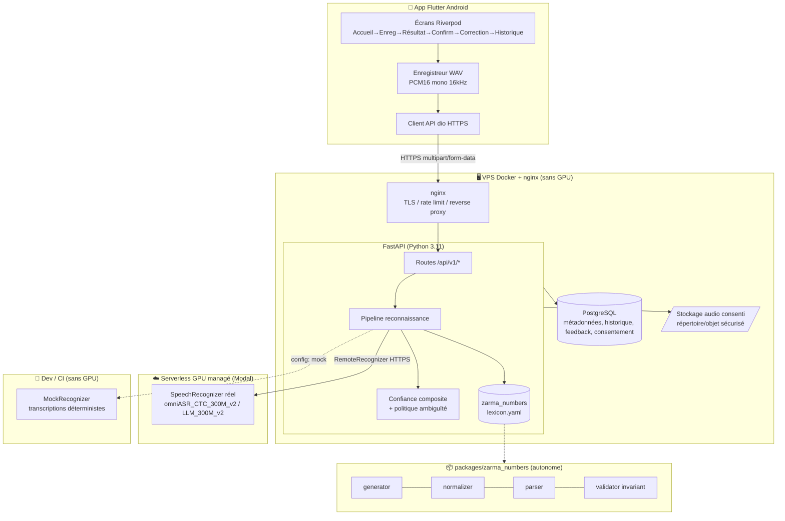
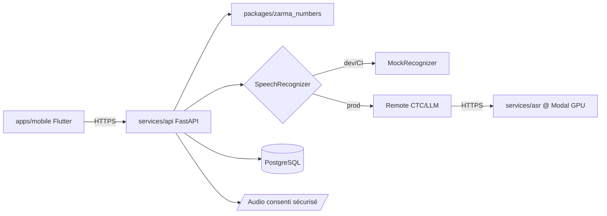
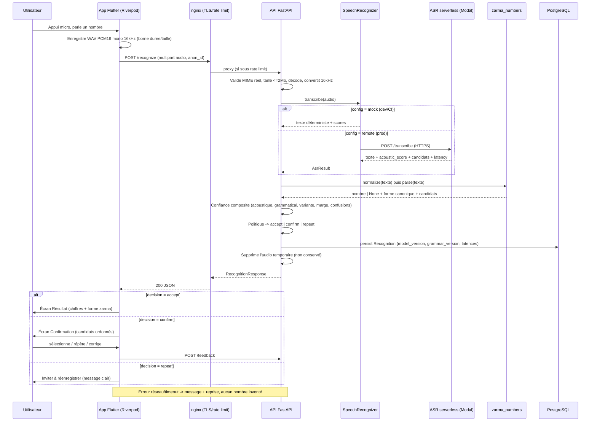
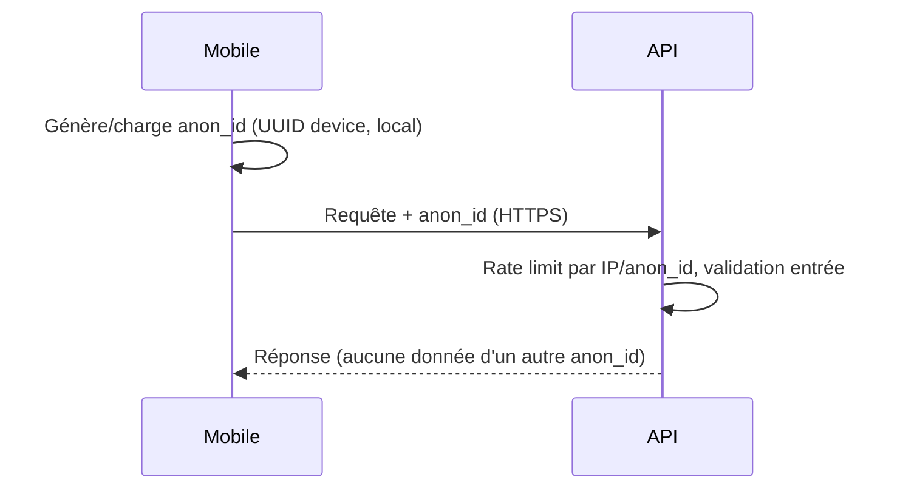
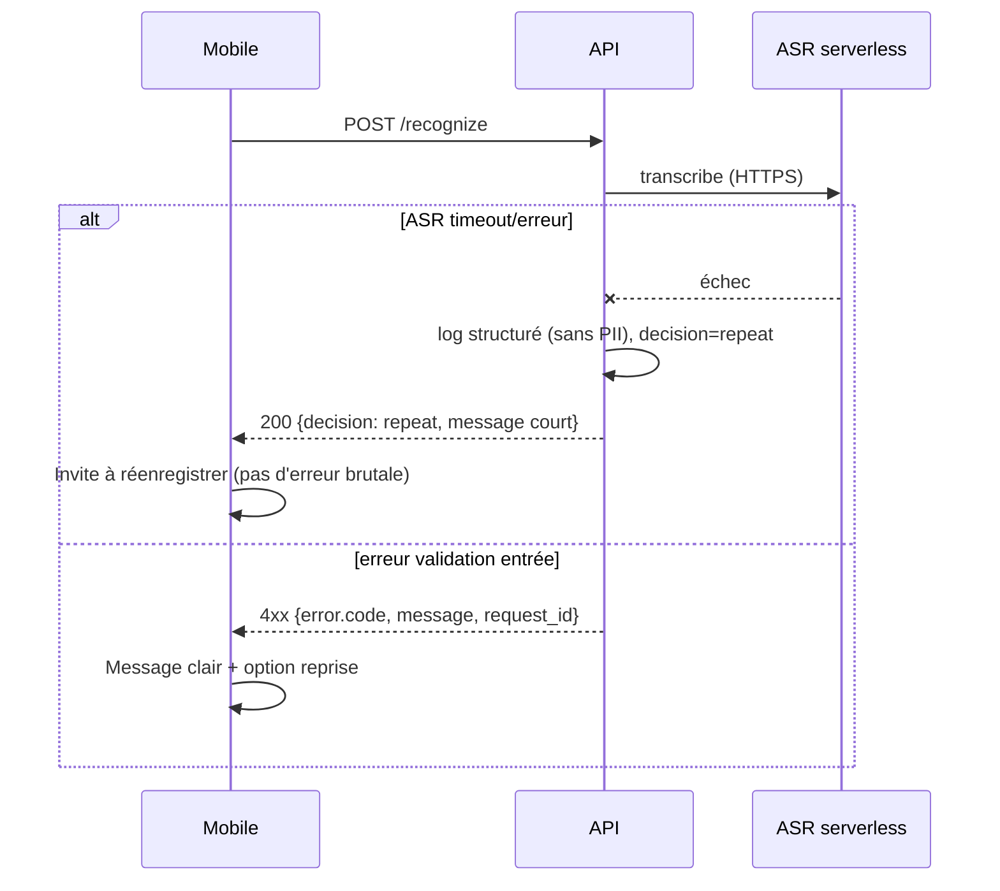

# Zarma — Reconnaissance des nombres prononcés en zarma — Fullstack Architecture Document

**Version :** 1.0
**Date :** 23 juillet 2026
**Auteur :** Winston (Architect, BMAD)
**Sources :** `docs/prd.md`, `docs/brief.md`, `docs/specification-complete-application-nombres-zarma.md`
**Statut :** Brouillon pour revue (généré en mode YOLO)

---

## Introduction

Ce document définit l'architecture fullstack complète de **Zarma — reconnaissance des nombres prononcés en zarma** : le paquet moteur linguistique déterministe, l'API FastAPI, le service ASR remplaçable (déployé en serverless GPU managé), l'application mobile Flutter Android, ainsi que leur intégration et leur déploiement. Il constitue la **source de vérité unique** pour le développement piloté par agents IA (dev/qa), garantissant la cohérence sur toute la pile.

L'architecture applique un principe directeur du PRD : **séparation stricte du moteur linguistique (déterministe, testable sans GPU) et du moteur vocal (audio → texte, remplaçable)**. Tout ce qui n'est pas l'ASR réel doit être développable et testable sans GPU, via `MockRecognizer`.

### Starter Template or Existing Project

**N/A — Projet greenfield.** Aucun starter template imposé. Le dépôt est un monorepo polyglotte (Python + Dart/Flutter) structuré manuellement selon les conventions du PRD (`Technical Assumptions → Monorepo`). Un `specification-complete-application-nombres-zarma.md` détaillé existe déjà et sert de référence complémentaire au PRD.

### Change Log

| Date | Version | Description | Author |
|------|---------|-------------|--------|
| 2026-07-23 | 1.0 | Création initiale de l'architecture à partir du PRD (mode YOLO). Décisions tranchées : Riverpod, ASR serverless managé, API sur VPS Docker. | Winston (Architect) |

---

## High Level Architecture

### Technical Summary

Zarma adopte une architecture **à trois couches découplées** au sein d'un **monorepo polyglotte**, adossée à un paquet Python autonome (le moteur linguistique). L'application **Flutter/Android** (état géré par **Riverpod**) enregistre un audio contraint (WAV PCM 16 bits mono 16 kHz) et dialogue en HTTPS avec une **API FastAPI (Python 3.11)** hébergée sur un **VPS Docker + nginx**. L'API orchestre le pipeline **ASR → normalisation → parsing → confiance composite → politique d'ambiguïté**, en s'appuyant sur le paquet déterministe `zarma_numbers` et sur une abstraction `SpeechRecognizer` remplaçable. Le moteur vocal Omnilingual (CTC & LLM) est déployé sur une **plateforme serverless GPU managée** (paiement à l'usage), l'API y accédant via un `RemoteRecognizer` léger — ce qui maintient le VPS et toute la CI **sans GPU**. La persistance est **SQLite (dev) → PostgreSQL (prod)** avec migrations Alembic, l'audio n'étant **jamais** stocké en base (répertoire/objet sécurisé, supprimé par défaut sauf consentement explicite). Cette architecture réalise les objectifs du PRD : dérisquer par le moteur linguistique testable sans GPU, garantir des choix ASR fondés sur les données, et rester **prudente** (confirmer/rejeter plutôt qu'inventer un nombre).

### Platform and Infrastructure Choice

Deux plateformes distinctes, alignées sur la séparation API légère / ASR lourde du PRD (NFR13) :

**Platform (API + données) :** VPS Linux auto-géré (ex. Hetzner / OVH / DigitalOcean) avec Docker Compose.
**Key Services (API) :** conteneur API FastAPI, conteneur PostgreSQL, reverse proxy nginx (TLS Let's Encrypt), volume de stockage audio consenti sécurisé, sauvegardes planifiées, monitoring léger (Uptime + logs structurés).
**Platform (ASR) :** Endpoint GPU serverless managé (**recommandé : Modal**, alternatives Replicate / HF Inference Endpoints) hébergeant les modèles Omnilingual CTC & LLM, exposé en HTTPS, paiement à l'usage, scale-to-zero.
**Deployment Host and Regions :** API et données en Europe (latence correcte vers l'Afrique de l'Ouest, souveraineté simple) ; endpoint ASR dans la région GPU disponible la plus proche (EU/US selon provider).

> **Rationale du choix ASR serverless managé (décision utilisateur) :** évite d'opérer une VM GPU 24/7 pour un dev solo, supprime le besoin d'une image Docker GPU lourde sur le VPS, et conserve la remplaçabilité (le `RemoteRecognizer` ne connaît qu'un contrat HTTP). Le risque n°1 « ressource GPU » est ainsi transformé en une dépendance à un service à l'usage, cadrée par l'interface `SpeechRecognizer`.

### Repository Structure

**Structure :** Monorepo unique `zarma-numbers/`.
**Monorepo Tool :** Aucun orchestrateur JS/TS (pas de Nx/Turborepo — pile polyglotte). Coordination via un **`Makefile` racine** + scripts. Côté Python, **`uv` workspace** relie `packages/zarma_numbers`, `services/api` et le client ASR ; côté mobile, un projet Flutter unique (`apps/mobile`). Le service modèle ASR (`services/asr`) est un paquet Python déployable indépendamment.
**Package Organization :** Frontières nettes — `packages/zarma_numbers` (cœur déterministe, zéro dépendance FastAPI/ASR), `services/api` (FastAPI, dépend de `zarma_numbers`), `services/asr` (déploiement modèle serverless), `apps/mobile` (Flutter). Les contrats partagés (schémas de réponse) sont définis en Pydantic côté API et redéfinis en modèles Dart côté mobile (typage indépendant, contrat versionné via OpenAPI).

### High Level Architecture Diagram



### Architectural Patterns

- **Séparation moteur linguistique / moteur vocal :** paquet déterministe `zarma_numbers` isolé de FastAPI et de l'ASR — _Rationale :_ dérisque le cœur produit, testable exhaustivement sans GPU (invariant `parse(generate(n)) == n`), réutilisable pour de futures apps vocales zarma.
- **Strategy / Adapter (SpeechRecognizer) :** interface abstraite avec implémentations Mock / Remote(CTC) / Remote(LLM) sélectionnables par configuration — _Rationale :_ NFR9, remplaçabilité du modèle vocal sans réécrire API ni mobile.
- **Pipeline (Chain of Responsibility) :** ASR → normalisation → parsing → scoring → politique, étapes explicites et testables — _Rationale :_ traçabilité de la décision et injection de Mock à l'étape ASR.
- **Repository Pattern (persistance) :** accès données via repositories (SQLAlchemy), audio hors base — _Rationale :_ migration SQLite→PostgreSQL transparente (FR22), testabilité.
- **Backend-decides, prudent-by-default :** la politique accepter/confirmer/répéter vit côté serveur ; le client n'invente jamais — _Rationale :_ FR13/FR21, éviter les erreurs numériques silencieuses.
- **Component-based UI + state management centralisé (Riverpod) :** écrans composés, état/effets via providers — _Rationale :_ testabilité des widgets et du flux de correction, un seul paradigme d'état.
- **Config-driven / Feature-flag ASR :** le choix `mock | ctc | llm` et les poids/seuils de confiance sont pilotés par variables d'environnement/fichier versionné — _Rationale :_ calibration (Epic 5) rechargeable sans changement de code (FR12, story 5.5).
- **Contract-first (OpenAPI) :** le schéma OpenAPI généré est le contrat mobile↔API — _Rationale :_ typage Dart aligné, `model_version`+`grammar_version` systématiques (NFR12).

---

## Tech Stack

Ceci est la **sélection technologique définitive** du projet. Tout le développement doit utiliser ces choix et versions.

| Category | Technology | Version | Purpose | Rationale |
|----------|-----------|---------|---------|-----------|
| Frontend Language | Dart | 3.5.x | Langage app mobile | Requis par Flutter, typage sain, null-safety |
| Frontend Framework | Flutter | 3.24.x (stable) | App Android MVP | Imposé PRD ; un seul codebase, perf native audio |
| UI Component Library | Material 3 (Flutter built-in) | — | Composants UI accessibles | WCAG AA, cibles tactiles larges, thème sobre |
| State Management | **Riverpod** | 2.5.x | Gestion d'état / DI | **Décision Architect** : testable, DI intégrée, pas de boilerplate Bloc, providers pour async (recognize/history) |
| Backend Language | Python | 3.11.x | API + moteur linguistique | Imposé PRD (NFR15) |
| Backend Framework | FastAPI | 0.115.x | API REST asynchrone | Imposé PRD ; OpenAPI natif, Pydantic, async I/O |
| Validation / Schemas | Pydantic | 2.9.x | Schémas requêtes/réponses | Validation stricte des entrées (NFR5), contrats typés |
| Linguistic Engine | Paquet `zarma_numbers` | 0.1.0 | texte↔nombre déterministe | Cœur produit, autonome (NFR8) |
| API Style | REST (OpenAPI 3.0) | 3.0 | Contrat mobile↔API | multipart pour `/recognize` (FR10), doc auto |
| Database (dev) | SQLite | 3.x | Persistance locale dev | FR22, zéro service à lancer en dev |
| Database (prod) | PostgreSQL | 16.x | Persistance production | FR22, robustesse, JSONB pour métadonnées |
| ORM / Migrations | SQLAlchemy + Alembic | 2.0.x / 1.13.x | Accès données + migrations | Repository pattern, migrations versionnées (FR22) |
| ASR Runtime | Meta Omnilingual ASR | omniASR_CTC_300M_v2 / omniASR_LLM_300M_v2 | audio→texte `dje_Latn` | Apache 2.0, support zarma, choix final après benchmark (Epic 5) |
| ASR ML deps | PyTorch + transformers/fairseq2 | selon modèle | Inference modèle | Python `>=3.10,<3.14` (NFR15), isolé côté serverless |
| ASR Hosting | **Modal** (serverless GPU) | — | Endpoint inference managé | Décision utilisateur : pay-per-use, scale-to-zero, modèle Python arbitraire, pas d'ops GPU |
| Audio (mobile) | `record`, `path_provider` | 5.x / 2.x | Capture WAV PCM16 mono 16kHz | Imposé PRD (FR1) |
| HTTP client (mobile) | `dio` | 5.x | Appels API, timeouts, retry | Imposé PRD, intercepteurs erreurs réseau |
| File Storage | Répertoire chiffré VPS / S3-compatible (option MinIO) | — | Audio consenti uniquement | Audio hors base (FR22), suppression par défaut (FR20) |
| Authentication | Identifiant anonyme (device UUID) + clé API front non secrète | — | Anonymat contributeurs | NFR7 ; pas d'auth utilisateur MVP, HTTPS + rate limit |
| Rate Limiting | slowapi (starlette-limiter) | 0.1.x | Protection `/recognize`, `/recordings` | NFR4, story 2.7 |
| Frontend Testing | flutter_test + mocktail | SDK / 1.x | Widgets, flux correction | Testing Requirements PRD |
| Backend Testing | pytest + httpx + pytest-asyncio | 8.x | Unitaires + intégration (Mock) | Invariant exhaustif, endpoints sans GPU |
| Linguistic Testing | pytest + hypothesis | 8.x / 6.x | Invariant + property-based | `parse(generate(n))==n` sur 0–1 000 000 |
| E2E Testing | pytest (harnais benchmark) + tests manuels device | — | Exact Number Accuracy (Epic 5) | Harnais d'évaluation, pas test unitaire |
| Python tooling | uv + ruff + black | latest | Deps, lint, format | Rapide, reproductible, workspace multi-paquets |
| Build/Deploy | Docker + Docker Compose | 27.x / v2 | Images API légère / infra | NFR13, images séparées |
| IaC / Config | docker-compose + `.env` + nginx conf versionnées | — | Infra déclarative légère | Suffisant pour VPS mono-nœud MVP |
| CI/CD | GitHub Actions | — | lint + tests à chaque push | Story 1.1 AC4, sans GPU |
| Monitoring | Logs structurés (structlog) + Uptime Kuma + `/health` | — | Observabilité MVP | NFR6 (logs sans données sensibles), NFR1 (latences) |
| Logging | structlog (JSON) | 24.x | Logs sans PII | NFR6 |
| Secrets | `.env` hors Git + secrets provider (Modal secrets) | — | Clés endpoint ASR | NFR3 |

---

## Data Models

Entités métier principales, partagées conceptuellement entre API (Pydantic/SQLAlchemy) et mobile (modèles Dart). **Aucune n'stocke l'audio** — seuls des chemins/références et métadonnées.

### Recognition

**Purpose :** Une tentative de reconnaissance persistée (historique, traçabilité, métriques).

**Key Attributes :**
- `id`: UUID — identifiant
- `anon_id`: string — identifiant device anonyme (NFR7)
- `recognized_number`: int | null — nombre compris (null si rejet/répétition)
- `normalized_text`: string — texte zarma normalisé issu du pipeline
- `raw_asr_text`: string — transcription ASR brute (avant normalisation)
- `confidence`: float — score composite 0–1
- `decision`: enum(`accept` | `confirm` | `repeat`) — politique appliquée
- `alternatives`: json — candidats ordonnés `[{number, zarma_text, score}]`
- `model_version`: string — version ASR (NFR12)
- `grammar_version`: string — version lexique/grammaire (NFR12)
- `latency_total_ms`, `latency_asr_ms`: int — latences séparées (NFR1)
- `created_at`: datetime

**Dart interface (conceptuel) :**
```dart
class RecognitionResult {
  final int? recognizedNumber;
  final String zarmaText;          // forme canonique du nombre retenu
  final String normalizedText;
  final double confidence;
  final Decision decision;         // accept | confirm | repeat
  final List<Candidate> alternatives;
  final String modelVersion;
  final String grammarVersion;
}
class Candidate { final int number; final String zarmaText; final double score; }
enum Decision { accept, confirm, repeat }
```

**Relationships :**
- 1 Recognition → 0..N Feedback (corrections/confirmations liées)

### Feedback

**Purpose :** Correction ou confirmation utilisateur d'une reconnaissance (FR18, métriques Epic 4).

**Key Attributes :**
- `id`: UUID
- `recognition_id`: UUID → Recognition
- `anon_id`: string
- `feedback_type`: enum(`confirmed` | `corrected` | `rejected` | `repeat_requested`)
- `proposed_number`: int | null — ce que le système proposait
- `corrected_number`: int | null — ce que l'utilisateur a saisi
- `grammar_version`, `model_version`: string
- `created_at`: datetime

**Relationships :**
- N Feedback → 1 Recognition

### Consent

**Purpose :** Consentement explicite versionné avant toute contribution vocale conservée (FR19, story 4.1).

**Key Attributes :**
- `id`: UUID
- `anon_id`: string
- `consent_version`: string — version du texte de consentement accepté
- `accepted_at`: datetime
- `withdrawn`: bool — retrait exercé (FR/ story 4.4)
- `withdrawn_at`: datetime | null

**Relationships :**
- 1 Consent → 0..N Contribution

### Contribution (Recording metadata)

**Purpose :** Métadonnées d'une contribution vocale consentie (l'audio est hors base, FR20/FR22, story 4.3). L'audio ordinaire de `/recognize` n'est **jamais** conservé.

**Key Attributes :**
- `id`: UUID
- `anon_id`: string
- `consent_id`: UUID → Consent (consentement valide requis)
- `expected_prompt`: string — nombre attendu (prompt généré)
- `expected_number`: int
- `audio_ref`: string — chemin/clé de l'objet audio sécurisé (jamais l'audio lui-même)
- `region`, `device_info`: string | null — métadonnées optionnelles
- `status`: enum(`pending` | `validated` | `rejected` | `withdrawn`) — cycle de validation (story 4.5)
- `speaker_key`: string — clé locuteur pour split par locuteur (NFR10)
- `model_version`, `grammar_version`: string
- `created_at`: datetime

**Relationships :**
- N Contribution → 1 Consent
- Contributions groupées par `speaker_key` (split par locuteur, NFR10)

### GrammarVersionInfo (valeur, non persistée)

**Purpose :** Exposer version lexique/grammaire et couverture (`validé` vs `unresolved`) — FR7, endpoint `/grammar/version`.

---

## API Specification

API REST versionnée `v1`. Extrait OpenAPI 3.0 des endpoints du PRD (FR11).

```yaml
openapi: 3.0.0
info:
  title: Zarma Numbers Recognition API
  version: 1.0.0
  description: >
    Reconnaissance des nombres prononcés en zarma (dje_Latn).
    Pipeline ASR -> normalisation -> parsing -> confiance composite -> politique.
    L'audio ordinaire n'est jamais conservé ; conservation uniquement sur consentement.
servers:
  - url: https://api.zarma.example/api/v1
    description: Production (VPS)
  - url: http://localhost:8000/api/v1
    description: Développement local

paths:
  /health:
    get:
      summary: Statut du service
      responses:
        '200': { description: OK }

  /models:
    get:
      summary: Liste des recognizers disponibles et actif
      responses:
        '200':
          description: Recognizers
          content:
            application/json:
              schema:
                type: object
                properties:
                  active: { type: string, example: mock }
                  available:
                    type: array
                    items: { type: string }
                    example: [mock, ctc, llm]

  /grammar/version:
    get:
      summary: Version et couverture de la grammaire/lexique
      responses:
        '200':
          content:
            application/json:
              schema:
                type: object
                properties:
                  grammar_version: { type: string, example: "1.0.0" }
                  validated_count: { type: integer }
                  unresolved_items:
                    type: array
                    items: { type: string }
                    example: ["10000", "100000", "1000000"]

  /recognize:
    post:
      summary: Reconnaître un nombre à partir d'un audio
      requestBody:
        required: true
        content:
          multipart/form-data:
            schema:
              type: object
              required: [audio]
              properties:
                audio:
                  type: string
                  format: binary
                  description: WAV PCM16 mono 16kHz, <= ~2 Mo
                anon_id: { type: string }
      responses:
        '200':
          description: Résultat de reconnaissance
          content:
            application/json:
              schema: { $ref: '#/components/schemas/RecognitionResponse' }
        '400': { description: Audio invalide / MIME incohérent }
        '413': { description: Fichier trop volumineux }
        '422': { description: Validation Pydantic }
        '429': { description: Rate limit dépassé }

  /feedback:
    post:
      summary: Enregistrer une confirmation/correction utilisateur
      requestBody:
        required: true
        content:
          application/json:
            schema: { $ref: '#/components/schemas/FeedbackRequest' }
      responses:
        '201': { description: Feedback enregistré }

  /history:
    get:
      summary: Historique des reconnaissances d'un identifiant anonyme
      parameters:
        - in: query
          name: anon_id
          required: true
          schema: { type: string }
        - in: query
          name: limit
          schema: { type: integer, default: 50 }
      responses:
        '200':
          content:
            application/json:
              schema:
                type: array
                items: { $ref: '#/components/schemas/RecognitionResponse' }

  /recordings:
    post:
      summary: Uploader une contribution vocale consentie
      requestBody:
        required: true
        content:
          multipart/form-data:
            schema:
              type: object
              required: [audio, consent_id, expected_number]
              properties:
                audio: { type: string, format: binary }
                consent_id: { type: string }
                expected_number: { type: integer }
                anon_id: { type: string }
                region: { type: string }
      responses:
        '201': { description: Contribution reçue (status=pending) }
        '403': { description: Consentement absent/invalide }

  /consent:
    get:
      summary: Texte de consentement courant et sa version
      responses:
        '200':
          content:
            application/json:
              schema:
                type: object
                properties:
                  consent_version: { type: string }
                  text: { type: string }
    post:
      summary: Enregistrer l'acceptation d'un consentement versionné
      responses:
        '201': { description: Consentement enregistré }

  /recordings/withdraw:
    post:
      summary: Retirer les contributions d'un identifiant anonyme
      responses:
        '200': { description: Retrait effectué (audio supprimé, métadonnées anonymisées) }

components:
  schemas:
    RecognitionResponse:
      type: object
      properties:
        recognized_number: { type: integer, nullable: true }
        zarma_text: { type: string }
        normalized_text: { type: string }
        confidence: { type: number, format: float }
        decision: { type: string, enum: [accept, confirm, repeat] }
        alternatives:
          type: array
          items:
            type: object
            properties:
              number: { type: integer }
              zarma_text: { type: string }
              score: { type: number }
        model_version: { type: string }
        grammar_version: { type: string }
        latency_total_ms: { type: integer }
        latency_asr_ms: { type: integer }
    FeedbackRequest:
      type: object
      required: [recognition_id, feedback_type]
      properties:
        recognition_id: { type: string }
        anon_id: { type: string }
        feedback_type:
          type: string
          enum: [confirmed, corrected, rejected, repeat_requested]
        proposed_number: { type: integer, nullable: true }
        corrected_number: { type: integer, nullable: true }
    Error:
      type: object
      properties:
        error:
          type: object
          properties:
            code: { type: string }
            message: { type: string }
            request_id: { type: string }
            timestamp: { type: string }
```

---

## Components

### zarma_numbers (paquet moteur linguistique)

**Responsibility :** Conversion déterministe texte↔nombre zarma sur 0–1 000 000, normalisation, validation d'invariant. Zéro dépendance FastAPI/ASR.

**Key Interfaces :**
- `generate(n: int) -> str`
- `parse(text: str) -> int | None`
- `normalize(text: str) -> str` (idempotent)
- `load_lexicon() -> Lexicon` (+ `grammar_version`)
- `validate_invariant(range) -> Report`

**Dependencies :** aucune (stdlib + PyYAML). C'est le nœud de dérisquage.

**Technology Stack :** Python 3.11, PyYAML, pytest + hypothesis.

### API service (FastAPI)

**Responsibility :** Exposer les endpoints v1, orchestrer le pipeline, appliquer confiance/politique/sécurité, persister.

**Key Interfaces :** routes REST (voir API Spec), injection du `SpeechRecognizer` actif, repositories.

**Dependencies :** `zarma_numbers`, `SpeechRecognizer` (Mock/Remote), PostgreSQL/SQLite, stockage audio.

**Technology Stack :** FastAPI, Pydantic, SQLAlchemy/Alembic, slowapi, structlog.

### SpeechRecognizer (abstraction ASR)

**Responsibility :** Contrat audio→(texte + signaux acoustiques + métadonnées). Rend le moteur vocal remplaçable.

**Key Interfaces :**
```python
class SpeechRecognizer(Protocol):
    def transcribe(self, audio: AudioInput) -> AsrResult: ...
    @property
    def model_version(self) -> str: ...

# AsrResult: text, acoustic_score, candidates?, latency_ms, model_version
```
Implémentations : `MockRecognizer` (déterministe, tests/dev), `RemoteCtcRecognizer` / `RemoteLlmRecognizer` (client HTTPS vers l'endpoint Modal).

**Dependencies :** MockRecognizer → aucune ; Remote* → endpoint serverless (httpx).

**Technology Stack :** Python, httpx (client), Protocol/ABC.

### ASR model server (services/asr)

**Responsibility :** Charger et servir Omnilingual CTC/LLM sur GPU serverless ; exposer un endpoint HTTPS `transcribe`.

**Key Interfaces :** `POST /transcribe` (audio → texte + scores acoustiques + candidats).

**Dependencies :** PyTorch, modèle Omnilingual, GPU managé (Modal). Déployé/redémarré **indépendamment** de l'API (NFR13, story 5.3).

**Technology Stack :** Python 3.10–3.13, Modal, PyTorch/transformers.

### Mobile app (Flutter)

**Responsibility :** Parcours utilisateur complet, enregistrement contraint, appels API, gestion erreurs/réseaux lents.

**Key Interfaces :** écrans + providers Riverpod + `ApiClient` (dio).

**Dependencies :** API (HTTPS), permissions micro.

**Technology Stack :** Flutter, Riverpod, record, dio, path_provider.

### Component Diagram



---

## External APIs

### Modal (Serverless GPU inference) — ASR

- **Purpose :** Héberger et servir les modèles Omnilingual ASR (CTC & LLM) sur GPU à l'usage.
- **Documentation :** https://modal.com/docs
- **Base URL(s) :** endpoint HTTPS généré au déploiement (`https://<workspace>--zarma-asr-<fn>.modal.run`).
- **Authentication :** token/secret Modal (stocké en secret, jamais dans le repo ; côté API via `.env`).
- **Rate Limits :** selon plan Modal ; cold start possible (scale-to-zero) — géré par timeout + message « traitement » côté mobile.

**Key Endpoints Used :**
- `POST /transcribe` — audio (WAV PCM16 mono 16kHz) → `{ text, acoustic_score, candidates[], latency_ms, model_version }`

**Integration Notes :** Le contrat est encapsulé par `RemoteCtcRecognizer` / `RemoteLlmRecognizer`. En cas d'indisponibilité de Modal pour Omnilingual, alternatives interchangeables (Replicate, HF Inference Endpoints, ou VM GPU à la demande) — seule l'implémentation Remote change, ni l'API ni le mobile. Timeout et repli explicite (decision=`repeat`) si l'endpoint échoue.

### Meta Omnilingual ASR (modèle, Apache 2.0)

- **Purpose :** Poids modèles `omniASR_CTC_300M_v2` (sans `lang`) et `omniASR_LLM_300M_v2` (`lang=["dje_Latn"]`).
- **Documentation :** dépôt Meta Omnilingual ASR (Hugging Face / GitHub).
- **Integration Notes :** Chargés **dans** `services/asr` (Modal), pas appelés en tant qu'API tierce. Choix final CTC vs LLM décidé au benchmark (Epic 5) sur Exact Number Accuracy.

---

## Core Workflows

### Reconnaissance d'un nombre (chemin nominal + ambiguïté + erreur)



---

## Database Schema

DDL PostgreSQL (prod). En dev, SQLite via SQLAlchemy — mêmes modèles, migrations Alembic. **Aucune colonne n'contient d'audio binaire.**

```sql
CREATE TABLE recognitions (
    id              UUID PRIMARY KEY DEFAULT gen_random_uuid(),
    anon_id         TEXT NOT NULL,
    recognized_number BIGINT,                 -- NULL si rejet/répétition
    normalized_text TEXT NOT NULL DEFAULT '',
    raw_asr_text    TEXT NOT NULL DEFAULT '',
    confidence      REAL NOT NULL,
    decision        TEXT NOT NULL CHECK (decision IN ('accept','confirm','repeat')),
    alternatives    JSONB NOT NULL DEFAULT '[]',
    model_version   TEXT NOT NULL,
    grammar_version TEXT NOT NULL,
    latency_total_ms INTEGER,
    latency_asr_ms   INTEGER,
    created_at      TIMESTAMPTZ NOT NULL DEFAULT now()
);
CREATE INDEX idx_recognitions_anon ON recognitions(anon_id, created_at DESC);

CREATE TABLE feedbacks (
    id              UUID PRIMARY KEY DEFAULT gen_random_uuid(),
    recognition_id  UUID NOT NULL REFERENCES recognitions(id) ON DELETE CASCADE,
    anon_id         TEXT NOT NULL,
    feedback_type   TEXT NOT NULL CHECK (feedback_type IN ('confirmed','corrected','rejected','repeat_requested')),
    proposed_number BIGINT,
    corrected_number BIGINT,
    model_version   TEXT NOT NULL,
    grammar_version TEXT NOT NULL,
    created_at      TIMESTAMPTZ NOT NULL DEFAULT now()
);
CREATE INDEX idx_feedbacks_recognition ON feedbacks(recognition_id);

CREATE TABLE consents (
    id              UUID PRIMARY KEY DEFAULT gen_random_uuid(),
    anon_id         TEXT NOT NULL,
    consent_version TEXT NOT NULL,
    accepted_at     TIMESTAMPTZ NOT NULL DEFAULT now(),
    withdrawn       BOOLEAN NOT NULL DEFAULT false,
    withdrawn_at    TIMESTAMPTZ
);
CREATE INDEX idx_consents_anon ON consents(anon_id);

CREATE TABLE contributions (
    id              UUID PRIMARY KEY DEFAULT gen_random_uuid(),
    anon_id         TEXT NOT NULL,
    consent_id      UUID NOT NULL REFERENCES consents(id),
    expected_number BIGINT NOT NULL,
    expected_prompt TEXT NOT NULL,
    audio_ref       TEXT,                       -- chemin/clé objet ; NULL si retiré
    speaker_key     TEXT NOT NULL,              -- split par locuteur (NFR10)
    region          TEXT,
    device_info     TEXT,
    status          TEXT NOT NULL DEFAULT 'pending'
                    CHECK (status IN ('pending','validated','rejected','withdrawn')),
    model_version   TEXT NOT NULL,
    grammar_version TEXT NOT NULL,
    created_at      TIMESTAMPTZ NOT NULL DEFAULT now()
);
CREATE INDEX idx_contrib_speaker ON contributions(speaker_key);
CREATE INDEX idx_contrib_status  ON contributions(status);
```

---

## Frontend Architecture

### Component Architecture

#### Component Organization

```text
apps/mobile/lib/
├── main.dart                      # bootstrap + ProviderScope (Riverpod)
├── app.dart                       # MaterialApp + routing + thème M3
├── core/
│   ├── config/                    # app_config (URL API non secrète), env
│   ├── network/                   # dio client, intercepteurs, erreurs
│   └── theme/                     # thème sobre, contrastes WCAG AA
├── features/
│   ├── recording/                 # enregistrement contraint WAV
│   │   ├── data/                  # recorder service (record)
│   │   ├── application/           # providers (état enregistrement)
│   │   └── presentation/          # écrans Accueil, Enregistrement
│   ├── recognition/
│   │   ├── data/                  # recognize repository (dio)
│   │   ├── application/           # recognitionProvider (async)
│   │   └── presentation/          # Traitement, Résultat, Confirmation
│   ├── correction/                # clavier num + forme zarma
│   ├── history/                   # écran Historique (/history)
│   └── contribution/              # consentement + prompts + upload
└── shared/
    ├── models/                    # RecognitionResult, Candidate, etc.
    └── widgets/                   # MicButton, ZarmaNumberDisplay, StateBanner
```

#### Component Template

```dart
// Écran piloté par un provider async (pattern répété)
class ResultScreen extends ConsumerWidget {
  const ResultScreen({super.key});
  @override
  Widget build(BuildContext context, WidgetRef ref) {
    final state = ref.watch(recognitionProvider);
    return state.when(
      data: (r) => ResultView(number: r.recognizedNumber, zarma: r.zarmaText),
      loading: () => const ProcessingIndicator(),   // annulable
      error: (e, _) => RetryBanner(onRetry: () => ref.invalidate(recognitionProvider)),
    );
  }
}
```

### State Management Architecture

#### State Structure

```dart
// Providers Riverpod (DI + async)
final apiClientProvider = Provider<ApiClient>((ref) => ApiClient(ref.read(appConfigProvider)));

final recorderProvider = Provider<AudioRecorder>((ref) => AudioRecorder()); // WAV PCM16 mono 16kHz

// Reconnaissance : reçoit le fichier audio, appelle /recognize
final recognitionProvider =
    FutureProvider.autoDispose.family<RecognitionResult, String>((ref, audioPath) async {
  final api = ref.read(apiClientProvider);
  return api.recognize(audioPath, anonId: ref.read(anonIdProvider));
});

final historyProvider = FutureProvider.autoDispose<List<RecognitionResult>>((ref) async {
  return ref.read(apiClientProvider).history(ref.read(anonIdProvider));
});
```

#### State Management Patterns

- Un provider par préoccupation async (recognize, history, consent) avec `autoDispose` pour libérer.
- `anon_id` (UUID device) généré une fois, stocké localement (non secret), injecté par provider.
- Aucune logique de décision numérique côté client : l'app **affiche** `decision` (accept/confirm/repeat) renvoyée par l'API.
- Effets (permission micro, annulation requête via `CancelToken` dio) gérés dans la couche application, jamais dans les widgets.

### Routing Architecture

#### Route Organization

```text
/                -> AccueilScreen (bouton micro)
/record          -> EnregistrementScreen
/processing      -> TraitementScreen (annulable)
/result          -> ResultScreen
/confirm         -> ConfirmationScreen (candidats)
/correct         -> CorrectionScreen (clavier num + forme zarma)
/history         -> HistoriqueScreen
/contribute      -> Consentement -> Prompt -> Enregistrement consenti
```

#### Protected Route Pattern

```dart
// Pas d'auth utilisateur au MVP ; "protection" = pré-requis fonctionnels
// Ex : le flux contribution exige un consentement valide en amont.
Widget contributionGuard(WidgetRef ref, Widget child) {
  final consent = ref.watch(consentStatusProvider);
  return consent.hasValidConsent ? child : const ConsentScreen();
}
```

### Frontend Services Layer

#### API Client Setup

```dart
class ApiClient {
  final Dio _dio;
  ApiClient(AppConfig cfg)
      : _dio = Dio(BaseOptions(
          baseUrl: cfg.apiBaseUrl,                 // non secret
          connectTimeout: const Duration(seconds: 5),
          receiveTimeout: const Duration(seconds: 30), // ASR peut être lent
        ))..interceptors.add(ErrorMappingInterceptor());
}
```

#### Service Example

```dart
Future<RecognitionResult> recognize(String audioPath, {required String anonId}) async {
  final form = FormData.fromMap({
    'audio': await MultipartFile.fromFile(audioPath, filename: 'rec.wav'),
    'anon_id': anonId,
  });
  final res = await _dio.post('/recognize', data: form);
  return RecognitionResult.fromJson(res.data);
}
```

---

## Backend Architecture

### Service Architecture

Architecture **serveur traditionnel** (FastAPI conteneurisé), pas serverless côté API. Seul l'ASR est serverless.

#### Controller/Route Organization

```text
services/api/app/
├── main.py                     # app FastAPI, middlewares, routers, lifespan
├── config.py                   # settings Pydantic (env), pas de secret en dur
├── api/v1/
│   ├── health.py               # /health
│   ├── models.py               # /models
│   ├── grammar.py              # /grammar/version
│   ├── recognize.py            # /recognize (pipeline)
│   ├── feedback.py             # /feedback
│   ├── history.py              # /history
│   ├── recordings.py           # /recordings, /recordings/withdraw
│   └── consent.py              # /consent
├── pipeline/
│   ├── audio.py                # validation MIME, décodage, conversion 16kHz
│   ├── confidence.py           # score composite (poids configurables)
│   └── policy.py               # accept | confirm | repeat
├── asr/
│   ├── base.py                 # SpeechRecognizer (Protocol/ABC)
│   ├── mock.py                 # MockRecognizer
│   ├── remote.py               # RemoteCtc/LlmRecognizer (httpx -> Modal)
│   └── factory.py              # sélection par config (mock|ctc|llm)
├── db/
│   ├── session.py              # engine SQLite/PostgreSQL
│   ├── models.py               # SQLAlchemy ORM
│   └── repositories.py         # Repository pattern
├── storage/
│   └── audio_store.py          # écriture/suppression audio consenti (hors base)
└── core/
    ├── errors.py               # handler d'erreurs normalisé (sans PII)
    ├── logging.py              # structlog JSON
    └── rate_limit.py           # slowapi
```

#### Controller Template

```python
@router.post("/recognize", response_model=RecognitionResponse)
@limiter.limit("10/minute")
async def recognize(request: Request, audio: UploadFile = File(...),
                    anon_id: str = Form(...),
                    recognizer: SpeechRecognizer = Depends(get_recognizer),
                    repo: RecognitionRepo = Depends(get_repo)):
    pcm = await validate_and_decode(audio)          # MIME réel, <=2Mo, 16kHz
    t0 = perf_counter()
    asr = recognizer.transcribe(pcm)                # mock ou remote
    text = normalize(asr.text)                      # zarma_numbers
    number = parse(text)                            # None si non numérique
    score = composite_confidence(asr, number, text) # signaux pondérés
    decision = decide(score, number)                # accept|confirm|repeat
    result = build_response(number, text, asr, score, decision,
                            grammar_version=GRAMMAR_VERSION,
                            latency_asr_ms=asr.latency_ms,
                            latency_total_ms=elapsed_ms(t0))
    await repo.save(result, anon_id)                # persist (audio non conservé)
    return result
```

### Database Architecture

#### Schema Design

Voir section **Database Schema** ci-dessus (DDL PostgreSQL + équivalent SQLite via SQLAlchemy).

#### Data Access Layer

```python
class RecognitionRepo:
    def __init__(self, session: AsyncSession): self._s = session

    async def save(self, r: RecognitionResponse, anon_id: str) -> None:
        self._s.add(Recognition(anon_id=anon_id, recognized_number=r.recognized_number,
                                normalized_text=r.normalized_text, confidence=r.confidence,
                                decision=r.decision, alternatives=r.alternatives,
                                model_version=r.model_version, grammar_version=r.grammar_version,
                                latency_total_ms=r.latency_total_ms, latency_asr_ms=r.latency_asr_ms))
        await self._s.commit()

    async def history(self, anon_id: str, limit: int = 50) -> list[Recognition]:
        q = select(Recognition).where(Recognition.anon_id == anon_id)\
            .order_by(Recognition.created_at.desc()).limit(limit)
        return (await self._s.execute(q)).scalars().all()
```

### Authentication and Authorization

Pas d'authentification utilisateur au MVP. **Identité = `anon_id`** (UUID device, non secret, non identifiant personnel — NFR7). La protection repose sur : HTTPS obligatoire, rate limiting, contrôles d'entrée stricts, et absence de données sensibles/PII. Le secret unique côté serveur est le token de l'endpoint ASR (stocké hors Git).



```python
# "Guard" : consentement requis pour /recordings
async def require_valid_consent(consent_id: str, repo: ConsentRepo = Depends(...)) -> Consent:
    c = await repo.get(consent_id)
    if c is None or c.withdrawn:
        raise HTTPException(403, detail="Consentement absent ou retiré")
    return c
```

---

## Unified Project Structure

```plaintext
zarma-numbers/
├── .github/
│   └── workflows/
│       └── ci.yaml                 # lint + tests zarma_numbers + API (Mock), sans GPU
├── apps/
│   └── mobile/                     # App Flutter Android (Riverpod)
│       ├── lib/                    # cf. Frontend Architecture
│       ├── test/                   # flutter_test + mocktail
│       ├── android/
│       └── pubspec.yaml
├── services/
│   ├── api/                        # FastAPI (léger, sans GPU)
│   │   ├── app/                    # cf. Backend Architecture
│   │   ├── tests/                  # pytest (intégration via MockRecognizer)
│   │   ├── alembic/                # migrations
│   │   ├── Dockerfile              # image API légère
│   │   └── pyproject.toml
│   └── asr/                        # Service modèle ASR (serverless GPU)
│       ├── app/                    # Modal app : chargement CTC/LLM, /transcribe
│       ├── tests/                  # smoke tests (Epic 5)
│       └── pyproject.toml
├── packages/
│   └── zarma_numbers/              # Paquet autonome (cœur déterministe)
│       ├── src/zarma_numbers/
│       │   ├── lexicon.yaml        # lexique versionné (validé/unresolved)
│       │   ├── loader.py           # chargement + grammar_version
│       │   ├── normalizer.py
│       │   ├── generator.py
│       │   ├── parser.py
│       │   ├── validator.py        # invariant parse(generate(n))==n
│       │   └── exceptions.py
│       ├── tests/                  # pytest + hypothesis
│       └── pyproject.toml
├── dataset/
│   ├── raw/                        # (git-ignored) audio consenti
│   ├── manifests/                  # manifest versionné, split par locuteur
│   └── benchmark/                  # corpus d'évaluation (Epic 5)
├── infrastructure/
│   ├── docker-compose.yml          # api + postgres + nginx
│   ├── docker-compose.staging.yml
│   ├── nginx/                      # conf reverse proxy + TLS
│   └── backup/                     # scripts de sauvegarde PostgreSQL
├── scripts/                        # bootstrap, seed, bench, deploy
├── docs/
│   ├── prd.md
│   ├── architecture.md             # ce document
│   └── architecture/               # (shards générés)
├── .env.example                    # gabarit variables (aucun secret réel)
├── .gitignore                      # Python, Flutter, .env, dataset/raw, artefacts
├── Makefile                        # cibles transverses (lint, test, up, migrate)
├── pyproject.toml                  # uv workspace (racine Python)
└── README.md
```

---

## Development Workflow

### Local Development Setup

#### Prerequisites

```bash
# Python 3.11 + uv, Flutter 3.24, Docker
python3.11 --version
curl -LsSf https://astral.sh/uv/install.sh | sh
flutter --version
docker --version && docker compose version
```

#### Initial Setup

```bash
git clone <repo> zarma-numbers && cd zarma-numbers
cp .env.example .env                 # renseigner ASR_MODE=mock en dev
uv sync                              # installe zarma_numbers + services/api
cd apps/mobile && flutter pub get && cd -
make migrate                         # applique les migrations (SQLite en dev)
```

#### Development Commands

```bash
# Tout (API + DB) via Docker en dev
make up

# Moteur linguistique seul (sans GPU, sans API)
uv run pytest packages/zarma_numbers

# API seule (MockRecognizer, ASR_MODE=mock)
uv run uvicorn app.main:app --reload --app-dir services/api

# Mobile (contre l'API locale)
cd apps/mobile && flutter run

# Tests
uv run pytest packages/zarma_numbers services/api    # backend
cd apps/mobile && flutter test                        # mobile
make invariant                                        # invariant exhaustif 0..1_000_000
```

### Environment Configuration

#### Required Environment Variables

```bash
# Backend (services/api/.env — hors Git)
APP_ENV=development                 # development | staging | production
DATABASE_URL=sqlite+aiosqlite:///./zarma.db   # prod: postgresql+asyncpg://...
ASR_MODE=mock                       # mock | ctc | llm
ASR_ENDPOINT_URL=                   # (prod) URL Modal
ASR_ENDPOINT_TOKEN=                 # (prod) secret Modal — jamais committé
AUDIO_STORAGE_DIR=./storage/audio   # audio consenti uniquement
RATE_LIMIT_RECOGNIZE=10/minute
GRAMMAR_VERSION=1.0.0
LOG_LEVEL=INFO

# Frontend (apps/mobile — config non secrète)
API_BASE_URL=http://10.0.2.2:8000/api/v1   # émulateur Android -> host

# ASR service (services/asr — déploiement Modal)
MODAL_TOKEN_ID=...                  # secrets Modal (hors Git)
MODAL_TOKEN_SECRET=...
```

---

## Deployment Architecture

### Deployment Strategy

**Frontend Deployment :**
- **Platform :** APK/AAB (build Flutter) — distribution bêta (APK direct / piste interne Play Store post-MVP).
- **Build Command :** `flutter build apk --release` (ou `appbundle`).
- **Output Directory :** `apps/mobile/build/app/outputs/`.
- **CDN/Edge :** N/A (app native).

**Backend Deployment :**
- **Platform :** VPS Linux, Docker Compose (api + postgres + nginx).
- **Build Command :** `docker compose build`.
- **Deployment Method :** pull image / `docker compose up -d` derrière nginx (TLS Let's Encrypt) ; migrations Alembic au déploiement.

**ASR Deployment :**
- **Platform :** Modal (serverless GPU), `modal deploy services/asr/app`.
- **Deployment Method :** déploiement **indépendant** de l'API ; l'API pointe vers l'URL via `ASR_ENDPOINT_URL`. Bascule `mock↔ctc↔llm` par variable d'environnement (NFR9, story 5.3).

### CI/CD Pipeline

```yaml
name: ci
on: [push, pull_request]
jobs:
  backend:
    runs-on: ubuntu-latest          # aucun GPU
    steps:
      - uses: actions/checkout@v4
      - uses: astral-sh/setup-uv@v3
      - run: uv sync
      - run: uv run ruff check .
      - run: uv run pytest packages/zarma_numbers services/api   # ASR_MODE=mock
      - run: uv run pytest -q packages/zarma_numbers/tests/test_invariant.py  # invariant
  mobile:
    runs-on: ubuntu-latest
    steps:
      - uses: actions/checkout@v4
      - uses: subosito/flutter-action@v2
        with: { flutter-version: '3.24.x' }
      - run: cd apps/mobile && flutter pub get && flutter analyze && flutter test
```

### Environments

| Environment | Frontend | Backend URL | Purpose |
|-------------|----------|-------------|---------|
| Development | Émulateur/device local | http://localhost:8000 (ASR mock) | Développement local sans GPU |
| Staging | APK interne | https://staging-api.zarma.example | Pré-production, ASR réel (endpoint de test) |
| Production | APK/AAB bêta | https://api.zarma.example | Bêta locuteurs réels |

---

## Security and Performance

### Security Requirements

**Frontend Security :**
- CSP Headers : N/A (app native) ; pas de WebView pour contenu distant.
- XSS/Injection : entrées numériques bornées côté client, revalidées côté serveur.
- Secure Storage : `anon_id` local non sensible ; **aucun secret embarqué** (NFR3) ; audio temporaire supprimé après envoi/annulation (FR2).

**Backend Security :**
- Input Validation : Pydantic + contrôles audio (MIME réel, décodage, taille ≤ ~2 Mo, conversion 16kHz, refus corrompus, aucune exécution — NFR5).
- Rate Limiting : slowapi sur `/recognize` et `/recordings` (NFR4).
- CORS : restreint aux origines attendues ; HTTPS obligatoire via nginx (NFR3).
- Logs : structlog sans PII ni audio (NFR6).

**Authentication Security :**
- Token Storage : secret endpoint ASR côté serveur uniquement (`.env`/secrets), jamais côté mobile.
- Session : sans état (anon_id) ; pas de mot de passe au MVP.
- Anonymisation & retrait : contributions anonymes, retrait supprime l'audio et anonymise les métadonnées (NFR7, story 4.4).

### Performance Optimization

**Frontend Performance :**
- Loading Strategy : indicateur d'activité non bloquant, requêtes annulables (`CancelToken`).
- Réseaux lents : timeouts explicites, messages clairs, réessai (NFR11).

**Backend Performance :**
- Response Time : latence **totale** et **ASR** mesurées séparément et persistées (NFR1, NFR12).
- ASR : gestion du cold start serverless (timeout + message « traitement ») ; repli `decision=repeat` si l'endpoint échoue.
- DB : index sur `anon_id`, `speaker_key`, `status` ; audio hors base pour garder la base légère.

---

## Testing Strategy

### Testing Pyramid

```text
        E2E / Benchmark (Epic 5, Exact Number Accuracy, split par locuteur)
       /                                                                   \
        Integration (API endpoints via MockRecognizer, sans GPU)
       /                                                                   \
 Frontend Unit (widgets, flux correction)          Backend Unit (invariant exhaustif, normalisation)
```

### Test Organization

#### Backend Tests

```text
packages/zarma_numbers/tests/
├── test_generator.py      # unités, dizaines, centaines, milliers, échelles
├── test_normalizer.py     # variantes ortho, connecteurs, idempotence
├── test_parser.py         # non-numérique -> None, paires de confusion distinctes
└── test_invariant.py      # parse(generate(n))==n sur 0..1_000_000 (CI)

services/api/tests/
├── test_health_models_grammar.py
├── test_recognize_pipeline.py   # nombre valide / non-numérique rejeté / audio invalide
├── test_audio_security.py       # corrompu, trop gros, MIME incohérent
├── test_confidence_policy.py    # haute confiance / ambiguïté / rejet
├── test_persistence.py          # history + feedback, model/grammar versions
└── test_rate_limit.py
```

#### Frontend Tests

```text
apps/mobile/test/
├── recording_test.dart      # bornes durée/taille, suppression fichier temp
├── recognition_flow_test.dart
├── correction_test.dart     # saisie -> forme zarma affichée
└── history_test.dart        # états vide/chargement/erreur
```

#### E2E / Benchmark Tests

```text
services/asr/tests/ + scripts/bench/
├── smoke_real_recognizer.py   # reconnaissance réelle de bout en bout (GPU)
└── run_benchmark.py           # Exact Number Accuracy + matrice de confusions
```

### Test Examples

#### Backend Unit (invariant)

```python
@pytest.mark.parametrize("n", range(0, 1_000_001, 1))  # exécuté en CI (chunké)
def test_roundtrip(n):
    assert parse(normalize(generate(n))) == n     # sur formes validées
```

#### Backend API Test

```python
async def test_recognize_rejects_non_numeric(client, mock_recognizer):
    mock_recognizer.set_text("salaam")            # non numérique
    r = await client.post("/api/v1/recognize", files={"audio": WAV_OK}, data={"anon_id": "a"})
    body = r.json()
    assert body["recognized_number"] is None
    assert body["decision"] == "repeat"           # jamais un nombre inventé (FR21)
```

#### Frontend Test

```dart
testWidgets('correction affiche la forme zarma', (tester) async {
  await tester.pumpWidget(wrap(const CorrectionScreen()));
  await tester.enterText(find.byType(NumberKeypad), '235');
  await tester.pump();
  expect(find.textContaining('zangu hinza nda '), findsOneWidget); // forme canonique
});
```

---

## Coding Standards

### Critical Fullstack Rules

- **Isolation du moteur linguistique :** `packages/zarma_numbers` ne doit **jamais** importer FastAPI, httpx, SQLAlchemy ni quoi que ce soit d'ASR. Toute conversion nombre↔zarma passe par ce paquet — aucune règle numérique dupliquée ailleurs.
- **Jamais de nombre inventé :** ni le parseur, ni l'API, ni le mobile ne produisent un nombre pour un texte non numérique — retour vide/`repeat` (FR21). Interdiction de tout fuzzy matching décisionnel (Levenshtein aveugle) pour trancher un nombre (NFR14).
- **Variantes ≠ corrections ASR :** deux structures distinctes. La normalisation utilise la table de variantes linguistiques ; les corrections d'erreurs ASR (calibrées en Epic 5) ne s'y mélangent jamais (FR8).
- **Versions systématiques :** toute réponse et toute ligne persistée portent `model_version` + `grammar_version` (NFR12).
- **ASR via l'interface uniquement :** l'API n'appelle jamais un modèle directement — toujours à travers `SpeechRecognizer`. Changer de modèle = changer une config, pas du code applicatif (NFR9).
- **Audio hors base + suppression par défaut :** aucun audio en base ; l'audio de `/recognize` est supprimé après traitement ; seul l'audio consenti est conservé (FR20/FR22).
- **Config via objet settings :** accès aux variables d'env uniquement via l'objet `settings` (Pydantic), jamais `os.environ` dispersé ; aucun secret en dur (NFR3).
- **Erreurs sans fuite :** toutes les routes passent par le handler d'erreurs normalisé — pas de stack trace ni de donnée interne exposée (NFR6, story 2.7).
- **État mobile via Riverpod :** aucune logique métier/async dans les widgets ; passer par les providers.

### Naming Conventions

| Element | Frontend (Dart) | Backend (Python) | Example |
|---------|-----------------|------------------|---------|
| Fichiers/modules | snake_case | snake_case | `result_screen.dart` / `recognize.py` |
| Classes | PascalCase | PascalCase | `RecognitionResult` / `MockRecognizer` |
| Providers | camelCase + `Provider` | — | `recognitionProvider` |
| Fonctions/vars | camelCase | snake_case | `recognize()` / `composite_confidence()` |
| API Routes | — | kebab-case | `/api/v1/grammar/version` |
| Tables DB | — | snake_case | `recognitions`, `contributions` |

---

## Error Handling Strategy

### Error Flow



### Error Response Format

```python
class ApiError(BaseModel):
    class _E(BaseModel):
        code: str            # ex: "AUDIO_INVALID", "RATE_LIMITED"
        message: str         # message sûr, sans détail interne
        request_id: str
        timestamp: str
    error: _E
```

### Frontend Error Handling

```dart
class ErrorMappingInterceptor extends Interceptor {
  @override
  void onError(DioException e, ErrorInterceptorHandler h) {
    final ui = switch (e.type) {
      DioExceptionType.connectionTimeout ||
      DioExceptionType.receiveTimeout => UiError.slowNetwork,
      _ when e.response?.statusCode == 429 => UiError.tooMany,
      _ => UiError.generic,
    };
    h.reject(e.copyWith(error: ui));   // affiché comme bannière + reprise
  }
}
```

### Backend Error Handling

```python
@app.exception_handler(Exception)
async def unhandled(request: Request, exc: Exception):
    rid = request.state.request_id
    log.error("unhandled", request_id=rid)          # jamais de PII/audio
    return JSONResponse(status_code=500, content={
        "error": {"code": "INTERNAL", "message": "Erreur interne",
                  "request_id": rid, "timestamp": now_iso()}})
```

---

## Monitoring and Observability

### Monitoring Stack

- **Frontend Monitoring :** journalisation locale des erreurs réseau + états UI (pas de PII) ; retours bêta manuels.
- **Backend Monitoring :** logs structurés JSON (structlog), endpoint `/health`, Uptime Kuma pour la disponibilité.
- **Error Tracking :** logs corrélés par `request_id` ; option Sentry post-MVP.
- **Performance Monitoring :** latences `total` et `ASR` persistées par reconnaissance et agrégées via `/metrics` (endpoint interne, story 4.6).

### Key Metrics

**Frontend Metrics :**
- Taux d'échec réseau / timeouts, temps perçu jusqu'au résultat, taux d'annulation.

**Backend Metrics (pilotage qualité, Epic 4/5) :**
- **Exact Number Accuracy** (benchmark), matrice de confusions.
- Taux de **confirmation** vs **correction** vs **rejet** (feedbacks).
- Latence totale / latence ASR (NFR1).
- Couverture linguistique : éléments `validé` vs `unresolved`.
- Taux de fausse acceptation (cible : minimiser via calibration Epic 5).

---

## Checklist Results Report

*(À compléter : exécuter la `architect-checklist` après validation de cette architecture par le porteur du projet. Non exécutée à ce stade — document généré en mode YOLO, en attente de revue. Lancer `*execute-checklist architect-checklist`.)*

---

## Décisions clés & risques résiduels

| # | Décision | Choix | Statut |
|---|----------|-------|--------|
| 1 | Gestion d'état Flutter | **Riverpod** | Tranché (Architect) |
| 2 | Hébergement API/prod | **VPS Docker + nginx** | Tranché (utilisateur) |
| 3 | Stratégie GPU/ASR (risque n°1 PRD) | **Endpoint serverless managé (Modal reco.)** via `RemoteRecognizer` | Tranché (utilisateur) |
| 4 | Modèle ASR MVP (CTC vs LLM) | **À décider par benchmark** | Ouvert — Epic 5 (non bloquant grâce au Mock) |
| 5 | Formes 10 000 / 100 000 / 1 000 000 | `unresolved` jusqu'à validation locuteurs | Ouvert — Epic 1 (story 1.2) |
| 6 | Disponibilité Omnilingual sur Modal | À valider techniquement (repli : Replicate/HF/VM GPU) | À vérifier — Epic 5 |

**Prochaines étapes :** exécuter `*execute-checklist architect-checklist`, puis `*shard-prd` pour éclater cette architecture, avant de passer au PO/SM (`/po`, `/sm`) pour la préparation des stories.