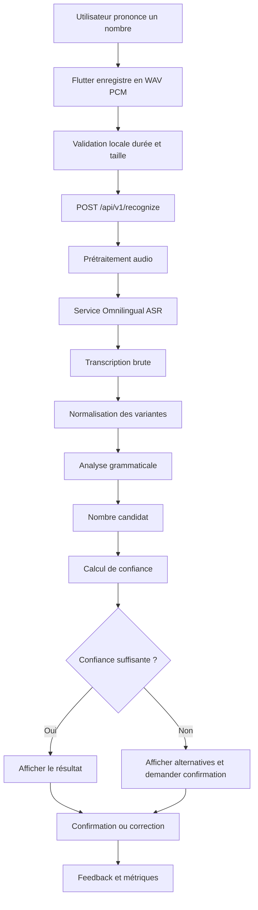

# Spécification complète du projet  
## Application mobile de reconnaissance des nombres prononcés en zarma

**Version :** 1.0  
**Date :** 23 juillet 2026  
**Statut :** document de cadrage et feuille de route d’implémentation  
**Langue ciblée :** zarma — code `dje_Latn`  
**Plage numérique visée :** de `0` à `1 000 000` inclus  
**Client mobile :** Flutter  
**Backend :** Python / FastAPI  
**Reconnaissance vocale :** Meta Omnilingual ASR, après benchmark réel  
**Principe central :** transcription vocale zarma → normalisation → parseur grammatical → nombre entier

---

# 1. But du projet

Créer une application mobile dans laquelle un utilisateur :

1. appuie sur un bouton microphone ;
2. prononce uniquement un nombre en zarma ;
3. envoie l’audio au serveur ;
4. reçoit :
   - la transcription brute ;
   - la transcription zarma normalisée ;
   - le nombre compris en chiffres ;
   - un niveau de confiance ;
   - une demande de confirmation lorsque le résultat est ambigu.

Exemple :

```text
Audio :
« zambar fo da zangou »

Transcription brute possible :
zambar fo da zangu

Texte normalisé :
zambar fo nda zangou

Nombre :
1 100
```

À terme, l’application pourra également répondre oralement en zarma grâce à un générateur `nombre → texte zarma`, puis à une solution vocale.

---

# 2. Périmètre de la première version

## 2.1 Inclus

- un seul nombre prononcé par enregistrement ;
- nombres entiers de `0` à `1 000 000` ;
- reconnaissance de variantes linguistiques validées ;
- affichage du nombre en chiffres ;
- affichage du texte zarma compris ;
- confirmation, correction et répétition ;
- historique local ou serveur ;
- collecte facultative de voix avec consentement ;
- système de feedback ;
- architecture permettant de remplacer le modèle ASR.

## 2.2 Non inclus dans le MVP

- phrases longues ;
- opérations mathématiques ;
- nombres décimaux ;
- monnaies ;
- dates ;
- numéros de téléphone ;
- plusieurs nombres dans la même phrase ;
- reconnaissance hors ligne sur le téléphone ;
- entraînement d’un modèle depuis zéro ;
- conversation générale en zarma.

## 2.3 Contraintes d’usage

- durée d’un enregistrement : idéalement 1 à 8 secondes ;
- limite maximale : 10 secondes ;
- un seul locuteur ;
- l’utilisateur doit prononcer seulement le nombre ;
- l’application doit rejeter le silence, le bruit extrême et les phrases non numériques ;
- lorsqu’un résultat est incertain, l’application doit demander une confirmation au lieu d’inventer.

---

# 3. Décisions techniques essentielles

## 3.1 Ne pas transcrire d’abord en français

La transcription française ne doit pas être le moteur principal. Un modèle français risque de transformer les sons zarma en mots français approximatifs et de confondre des formes proches telles que :

```text
hinka / hinza
iyye / yega
iddu / iyye
```

Le système doit utiliser un moteur multilingue capable de produire directement du texte zarma.

## 3.2 Ne pas stocker un million de combinaisons en base de données

Il n’est pas nécessaire de créer une table contenant les `1 000 001` nombres.

La meilleure solution est :

```text
lexique validé
+ règles grammaticales
+ normalisation
+ générateur nombre → zarma
+ parseur zarma → nombre
```

La base de données servira à conserver les reconnaissances, les corrections, les versions, les utilisateurs contributeurs et les enregistrements consentis.

## 3.3 Séparer le moteur linguistique du moteur vocal

Le parseur doit fonctionner sans reconnaissance vocale.

```text
Audio → ASR → texte
Texte → normaliseur → parseur → nombre
```

Cette séparation permet :

- de tester la grammaire indépendamment ;
- de remplacer le modèle vocal sans réécrire l’application ;
- de mesurer séparément les erreurs acoustiques et grammaticales ;
- de développer le projet même si le modèle vocal n’est pas encore installé.

## 3.4 Utiliser le serveur pour l’ASR

Le MacBook Pro M1 avec 8 Go de mémoire convient pour :

- Flutter ;
- FastAPI ;
- le parseur ;
- les tests ;
- la base locale ;
- la préparation du dataset.

Il ne faut pas considérer cette machine comme le serveur ASR de production. Les modèles Omnilingual ASR utilisent beaucoup de mémoire, et les chiffres de mémoire publiés sont mesurés sur GPU NVIDIA A100, pas sur Mac M1.

Architecture recommandée :

```text
Flutter
   ↓ HTTPS
API FastAPI
   ↓
Service ASR séparé
   ↓
Normaliseur et parseur
```

---

# 4. Points techniques vérifiés et corrections importantes

## 4.1 Support du zarma

Meta Omnilingual ASR contient officiellement le code :

```text
dje_Latn
```

Le projet annonce la prise en charge de plus de 1 600 langues.

## 4.2 Modèles CTC

Les modèles suivants sont rapides :

```text
omniASR_CTC_300M_v2
omniASR_CTC_1B_v2
omniASR_CTC_3B_v2
omniASR_CTC_7B_v2
```

Correction importante :

> Les modèles CTC ne prennent pas en charge le conditionnement par code de langue et n’acceptent pas les exemples contextuels.

Le test CTC doit donc être similaire à :

```python
from omnilingual_asr.models.inference.pipeline import ASRInferencePipeline

pipeline = ASRInferencePipeline(
    model_card="omniASR_CTC_300M_v2"
)

transcriptions = pipeline.transcribe(
    ["audio_zarma.wav"],
    batch_size=1,
)

print(transcriptions[0])
```

## 4.3 Modèles LLM conditionnés par la langue

Les modèles LLM acceptent un code de langue tel que `dje_Latn` :

```text
omniASR_LLM_300M_v2
omniASR_LLM_1B_v2
omniASR_LLM_3B_v2
omniASR_LLM_7B_v2
```

Exemple :

```python
from omnilingual_asr.models.inference.pipeline import ASRInferencePipeline

pipeline = ASRInferencePipeline(
    model_card="omniASR_LLM_300M_v2"
)

transcriptions = pipeline.transcribe(
    ["audio_zarma.wav"],
    lang=["dje_Latn"],
    batch_size=1,
)

print(transcriptions[0])
```

Ces modèles sont beaucoup plus lourds que les modèles CTC. Ils doivent être testés sur une machine adaptée, de préférence Linux avec GPU.

## 4.4 Modèle zero-shot

`omniASR_LLM_7B_ZS` peut recevoir de 1 à 10 couples :

```text
audio d’exemple + transcription correcte
```

Il est très lourd et ne constitue pas le premier choix pour le MVP. Il ne doit être testé qu’en expérimentation distante.

## 4.5 Audio

La pipeline officielle :

- accepte notamment WAV et FLAC ;
- convertit en mono ;
- rééchantillonne en 16 kHz ;
- normalise l’audio ;
- impose moins de 40 secondes pour les suites classiques.

Pour l’application, garder une limite plus stricte de 10 secondes.

## 4.6 Python et licence

- Python pris en charge par le paquet officiel : `>= 3.10` et `< 3.14` ;
- Python 3.11 est recommandé pour ce projet ;
- licence du dépôt Omnilingual ASR : Apache 2.0.

---

# 5. Architecture fonctionnelle



---

# 6. Architecture logicielle recommandée

```text
zarma-numbers/
├── apps/
│   └── mobile/
│       ├── android/
│       ├── ios/
│       ├── lib/
│       │   ├── app/
│       │   ├── core/
│       │   │   ├── config/
│       │   │   ├── errors/
│       │   │   ├── network/
│       │   │   └── theme/
│       │   ├── features/
│       │   │   ├── recorder/
│       │   │   ├── recognition/
│       │   │   ├── history/
│       │   │   ├── feedback/
│       │   │   └── contribution/
│       │   └── main.dart
│       └── test/
│
├── services/
│   ├── api/
│   │   ├── app/
│   │   │   ├── main.py
│   │   │   ├── api/
│   │   │   ├── core/
│   │   │   ├── database/
│   │   │   ├── models/
│   │   │   ├── schemas/
│   │   │   └── services/
│   │   ├── alembic/
│   │   ├── tests/
│   │   └── pyproject.toml
│   │
│   └── asr/
│       ├── app/
│       │   ├── base.py
│       │   ├── omnilingual_ctc.py
│       │   ├── omnilingual_llm.py
│       │   ├── preprocessing.py
│       │   └── main.py
│       ├── tests/
│       └── pyproject.toml
│
├── packages/
│   └── zarma_numbers/
│       ├── zarma_numbers/
│       │   ├── lexicon.yaml
│       │   ├── normalizer.py
│       │   ├── parser.py
│       │   ├── generator.py
│       │   ├── validator.py
│       │   └── exceptions.py
│       ├── tests/
│       └── pyproject.toml
│
├── dataset/
│   ├── metadata/
│   ├── prompts/
│   ├── raw/
│   ├── processed/
│   └── consent/
│
├── docs/
│   ├── numeration-zarma-v1.md
│   ├── linguistic-validation.md
│   ├── api.md
│   ├── dataset-protocol.md
│   ├── privacy.md
│   └── deployment.md
│
├── infrastructure/
│   ├── docker/
│   ├── nginx/
│   └── compose.yaml
│
├── scripts/
│   ├── generate_test_cases.py
│   ├── benchmark_asr.py
│   ├── validate_dataset.py
│   └── export_metrics.py
│
├── .env.example
├── .gitignore
├── Makefile
└── README.md
```

---

# 7. Spécification linguistique provisoire

Toutes les formes ci-dessous viennent des informations fournies. Elles doivent être considérées comme **provisoires** jusqu’à validation par des locuteurs natifs.

## 7.1 Unités

| Nombre | Forme isolée proposée | Forme combinée proposée | Statut |
|---:|---|---|---|
| 0 | yaamo | yaamo | à valider |
| 1 | afo | fo | à valider |
| 2 | ihinka | hinka | à valider |
| 3 | ihinza | hinza | à valider |
| 4 | itaci | taci | à valider |
| 5 | igou | gou | à valider |
| 6 | iddou | iddu | à valider |
| 7 | iyye | iyye | à valider |
| 8 | ahakou | hakou | à valider |
| 9 | iyega | yega | à valider |

## 7.2 Dizaines

| Nombre | Forme proposée | Statut |
|---:|---|---|
| 10 | iwey | à valider |
| 20 | waranka | à valider |
| 30 | waranza | à valider |
| 40 | waytaci | à valider |
| 50 | waygou | à valider |
| 60 | wayiddu | à valider |
| 70 | wayiyye | à valider |
| 80 | wayhakkou | à valider |
| 90 | wayyegga | à valider |

## 7.3 Échelles et connecteurs

| Élément | Forme proposée | Fonction | Statut |
|---|---|---|---|
| cent | zangou | échelle 100 | à valider |
| mille | zambar | échelle 1 000 | à valider |
| million | zambar yagga / miliyo / autre forme | échelle 1 000 000 | non résolu |
| cindi | cindi | dizaine + unité | à valider |
| et | nda / da | relier des groupes | à valider |

## 7.4 Exemples fournis

```text
11 = iwey cindi fo
13 = iwey cindi hinza
16 = iwey cindi iddu
18 = iwey cindi hakou
19 = iwey cindi yega

24 = waranka cindi taci
35 = waranza cindi gou
56 = waygou cindi iddu
67 = wayiddu cindi iyye
91 = wayyegga cindi fo
99 = wayyegga cindi yega

100 = zangou
101 = zangou nda fo
156 = zangou nda waygou cindi iddu
200 = zangou hinka
250 = zangou hinka nda waygou
372 = zangou hinza nda wayiyye cindi hinka
999 = zangou yega nda wayyegga cindi yega

1 000 = zambar fo
2 000 = zambar hinka

12 345 =
zambar iwey cindi hinka
nda zangou hinza
nda waytaci cindi gou

45 678 =
zambar waytaci cindi gou
nda zangou iddu
nda wayiyye cindi hakou

888 888 =
zambar zangou hakou
nda wayhakkou cindi hakou
nda zangou hakou
nda wayhakkou cindi hakou

999 999 =
zambar zangou yega
nda wayyegga cindi yega
nda zangou yega
nda wayyegga cindi yega
```

## 7.5 Incohérences à résoudre avant gel de la grammaire

- `iddou` ou `iddu` ;
- `iyega`, `yega` ou `yegga` ;
- `ahakou`, `hakou` ou `hakkou` ;
- `wayhakkou` ou une autre orthographe ;
- `nda` ou `da` ;
- `iwey` ou une variante ;
- `zangou` ou `zangu` ;
- forme exacte de 10 000 ;
- forme exacte de 100 000 ;
- forme exacte de 1 000 000 ;
- usage ou non de `fo` après `zambar` pour 1 000 ;
- comportement exact des voyelles initiales dans les formes combinées ;
- possibilité de plusieurs variantes régionales correctes.

Aucune variante ne doit être ajoutée au système sans :

1. validation par des locuteurs ;
2. présence dans une ressource linguistique fiable ;
3. ou observation répétée dans les transcriptions réelles.

---

# 8. Protocole de validation linguistique

## 8.1 Participants

Interroger séparément au moins trois locuteurs natifs du zarma.

Pour une meilleure fiabilité :

- viser ensuite 5 à 10 personnes ;
- inclure différentes tranches d’âge ;
- inclure des personnes de Niamey, Dosso et d’autres zones ;
- noter la région déclarée sans publier l’identité.

## 8.2 Méthode

Pour chaque nombre :

1. montrer seulement le nombre en chiffres ;
2. demander sa prononciation naturelle ;
3. écrire exactement la réponse ;
4. faire répéter une deuxième fois ;
5. montrer ensuite la proposition existante ;
6. demander si elle est correcte, naturelle ou régionale.

## 8.3 Nombres minimaux à vérifier

```text
0, 1, 2, 3, 4, 5, 6, 7, 8, 9,
10, 11, 12, 13, 16, 18, 19,
20, 24, 30, 35, 40, 50, 56, 60, 67, 70, 80, 90, 91, 99,
100, 101, 110, 111, 156, 200, 250, 372, 999,
1 000, 1 001, 1 010, 1 100, 2 000,
10 000, 12 345, 45 678, 100 000, 888 888, 999 999,
1 000 000
```

## 8.4 Questions à poser

- Comment prononces-tu naturellement ce nombre ?
- Cette forme est-elle correcte ?
- Cette forme est-elle naturelle ?
- Existe-t-il une autre manière de le dire ?
- Dis-tu `nda` ou `da` ?
- Dis-tu `zangou` ou `zangu` ?
- Dis-tu `iwey` ou une autre forme ?
- Comment dis-tu exactement 10 000 ?
- Comment dis-tu exactement 100 000 ?
- Comment dis-tu exactement 1 000 000 ?

## 8.5 Règle de décision

- unanimité : forme canonique ;
- majorité 2 sur 3 : forme majoritaire canonique, autre forme conservée comme variante ;
- désaccord complet : statut `À résoudre` ;
- variante reconnue comme correcte : ne pas la supprimer ;
- variante douteuse ou inventée : ne pas l’ajouter.

## 8.6 Fichier de résultat

Créer :

```text
docs/numeration-zarma-v1.md
```

Chaque ligne doit contenir :

```text
nombre
forme canonique
formes combinées
variantes acceptées
région éventuelle
nombre de validations
statut
notes
```

---

# 9. Lexique versionné

Exemple de structure `lexicon.yaml` :

```yaml
version: "1.0.0"
language: dje_Latn
status: draft

zero:
  value: 0
  canonical: yaamo
  variants:
    - yaamo

units:
  1:
    isolated: afo
    combined: fo
    variants:
      - afo
      - fo
  2:
    isolated: ihinka
    combined: hinka
    variants:
      - ihinka
      - hinka
  3:
    isolated: ihinza
    combined: hinza
    variants:
      - ihinza
      - hinza
  4:
    isolated: itaci
    combined: taci
    variants:
      - itaci
      - taci
  5:
    isolated: igou
    combined: gou
    variants:
      - igou
      - gou
  6:
    isolated: iddou
    combined: iddu
    variants:
      - iddou
      - iddu
  7:
    isolated: iyye
    combined: iyye
    variants:
      - iyye
  8:
    isolated: ahakou
    combined: hakou
    variants:
      - ahakou
      - hakou
  9:
    isolated: iyega
    combined: yega
    variants:
      - iyega
      - yega

tens:
  10: iwey
  20: waranka
  30: waranza
  40: waytaci
  50: waygou
  60: wayiddu
  70: wayiyye
  80: wayhakkou
  90: wayyegga

connectors:
  tens_unit:
    canonical: cindi
    variants:
      - cindi
  groups:
    canonical: nda
    variants:
      - nda
      - da

scales:
  hundred:
    value: 100
    canonical: zangou
    variants:
      - zangou
  thousand:
    value: 1000
    canonical: zambar
    variants:
      - zambar
  million:
    value: 1000000
    canonical: null
    variants: []
    status: unresolved
```

Une variante observée par l’ASR mais linguistiquement incorrecte ne doit pas automatiquement entrer dans ce lexique. Elle peut être ajoutée dans une table séparée d’erreurs acoustiques :

```yaml
asr_confusions:
  zangu: zangou
```

---

# 10. Normalisation du texte

Le normaliseur doit :

1. convertir en minuscules ;
2. supprimer ponctuation et espaces multiples ;
3. normaliser les apostrophes et caractères Unicode ;
4. remplacer les variantes validées par leur forme canonique ;
5. séparer les erreurs ASR des variantes linguistiques ;
6. ne pas corriger aveuglément les mots proches ;
7. produire une trace des transformations.

Exemple :

```json
{
  "raw": "Zambar fo da zangu",
  "normalized": "zambar fo nda zangou",
  "transformations": [
    {"from": "da", "to": "nda", "type": "linguistic_variant"},
    {"from": "zangu", "to": "zangou", "type": "asr_confusion"}
  ]
}
```

## 10.1 Interdiction du fuzzy matching aveugle

Ne pas convertir automatiquement le mot inconnu vers le mot le plus proche avec une simple distance de Levenshtein.

Exemple dangereux :

```text
hinka = 2
hinza = 3
```

Une seule lettre change, mais le nombre change complètement.

Le fuzzy matching peut uniquement :

- proposer des candidats ;
- être limité par la position grammaticale ;
- utiliser une liste de confusions observées ;
- déclencher une confirmation ;
- ne jamais forcer un résultat lorsque l’ambiguïté reste élevée.

---

# 11. Grammaire du parseur

## 11.1 Principe

Le parseur doit analyser des groupes hiérarchiques :

```text
unité
dizaine
centaine
millier
million
```

## 11.2 Règles provisoires

```text
0..9       → unité
10..99     → dizaine [cindi unité]
100..999   → zangou [multiplicateur] [nda reste_0_99]
1 000..999 999
            → zambar multiplicateur_1_999 [nda reste_0_999]
1 000 000  → forme spéciale validée
```

## 11.3 Pseudo-EBNF

```ebnf
number          = zero
                | under_hundred
                | under_thousand
                | thousands
                | million ;

zero            = "yaamo" ;

under_hundred   = unit
                | ten
                | ten, "cindi", unit_combined ;

under_thousand  = hundred_group
                | hundred_group, group_connector, under_hundred ;

hundred_group   = "zangou"
                | "zangou", unit_multiplier ;

thousands       = "zambar", multiplier_under_thousand
                | "zambar", multiplier_under_thousand,
                  group_connector, remainder_under_thousand ;

million         = million_canonical_or_variant ;

group_connector = "nda" | validated_variant ;
```

La grammaire finale doit refléter les validations réelles, même si celles-ci diffèrent de cette proposition.

## 11.4 API Python du paquet linguistique

```python
def normalize(text: str) -> NormalizationResult:
    ...

def parse(text: str) -> ParseResult:
    ...

def generate(number: int) -> str:
    ...

def validate_expression(text: str) -> ValidationResult:
    ...
```

## 11.5 Objets retournés

```python
@dataclass
class ParseCandidate:
    number: int
    normalized_text: str
    grammar_score: float
    warnings: list[str]

@dataclass
class ParseResult:
    best: ParseCandidate | None
    alternatives: list[ParseCandidate]
    accepted: bool
    error_code: str | None
```

## 11.6 Erreurs du parseur

Prévoir au minimum :

```text
EMPTY_INPUT
UNKNOWN_TOKEN
INVALID_TOKEN_ORDER
MISSING_MULTIPLIER
DUPLICATE_SCALE
OUT_OF_RANGE
AMBIGUOUS_EXPRESSION
NON_NUMERIC_SPEECH
UNRESOLVED_MILLION_FORM
```

---

# 12. Générateur nombre vers zarma

Le générateur doit produire une seule forme canonique.

```python
generate(24)
# "waranka cindi taci"

generate(372)
# "zangou hinza nda wayiyye cindi hinka"

generate(12345)
# "zambar iwey cindi hinka nda zangou hinza nda waytaci cindi gou"
```

Il doit refuser les valeurs hors plage :

```python
generate(-1)        # erreur
generate(1_000_001) # erreur
```

Le générateur sert à :

- créer les prompts d’enregistrement ;
- générer les cas de test ;
- afficher ce que l’application a compris ;
- préparer la future réponse vocale ;
- tester l’invariance :

```python
parse(generate(n)).number == n
```

Ce test doit réussir pour les `1 000 001` valeurs de `0` à `1 000 000`, une fois la grammaire validée.

---

# 13. Stratégie ASR

## 13.1 Créer une interface abstraite

```python
class SpeechRecognizer(Protocol):
    async def transcribe(self, audio_path: str) -> ASRResult:
        ...
```

Implémentations possibles :

```text
OmnilingualCTCRecognizer
OmnilingualLLMRecognizer
MockRecognizer
FutureFineTunedRecognizer
```

## 13.2 Benchmark obligatoire

Avant d’adopter un modèle :

- enregistrer au moins 100 audios ;
- utiliser plusieurs locuteurs ;
- inclure des nombres courts et longs ;
- inclure des mots proches ;
- garder une partie des locuteurs uniquement pour le test ;
- comparer au moins deux configurations.

Configurations recommandées :

### Baseline A

```text
omniASR_CTC_300M_v2
sans code de langue
```

### Baseline B

```text
omniASR_LLM_300M_v2
avec lang=["dje_Latn"]
```

### Option C

```text
modèle LLM supérieur ou zero-shot
uniquement si les ressources sont disponibles
```

## 13.3 Métriques

Mesurer séparément :

```text
CER
WER
Exact Transcript Accuracy
Exact Number Accuracy
Rejection Rate
False Acceptance Rate
Latency
```

La métrique principale est :

```text
Exact Number Accuracy =
nombre de nombres finaux corrects
÷ nombre total d’audios testés
```

## 13.4 Tableau de benchmark

```csv
audio_id,speaker_id,expected_number,expected_text,model,raw_transcript,normalized_text,predicted_number,correct,latency_ms,error_type
```

## 13.5 Critère de choix

Ne pas choisir automatiquement le modèle qui a le meilleur WER. Choisir celui qui produit le meilleur nombre final après normalisation et parsing.

Exemple :

```text
Transcription imparfaite mais nombre correct → acceptable
Transcription proche mais nombre faux → grave
```

---

# 14. Calcul de confiance

Le score final ne doit pas être uniquement le score ASR.

```text
final_confidence =
acoustic_score
+ grammar_validity
+ known_variant_score
+ candidate_margin
+ historical_confusion_score
```

Les poids devront être calibrés avec les données.

## 14.1 Règle de décision initiale

Exemple de politique provisoire :

```text
confidence >= 0.90
et expression grammaticale unique
→ accepter

0.70 <= confidence < 0.90
ou deux candidats proches
→ demander confirmation

confidence < 0.70
ou phrase invalide
→ demander de répéter
```

Ces seuils ne doivent pas être considérés comme définitifs avant calibration.

## 14.2 Alternatives

La réponse API peut contenir :

```json
"alternatives": [
  {
    "number": 12345,
    "normalized_text": "zambar iwey cindi hinka ...",
    "confidence": 0.82
  },
  {
    "number": 13345,
    "normalized_text": "zambar iwey cindi hinza ...",
    "confidence": 0.14
  }
]
```

---

# 15. Traitement audio

## 15.1 Configuration Flutter

Packages :

```bash
flutter pub add record dio path_provider
```

Configuration indicative :

```dart
final config = RecordConfig(
  encoder: AudioEncoder.pcm16bits,
  sampleRate: 16000,
  numChannels: 1,
  autoGain: true,
  echoCancel: true,
  noiseSuppress: true,
);
```

## 15.2 Format cible

```text
WAV
PCM 16 bits
mono
16 kHz
10 secondes maximum
```

## 15.3 Contrôles locaux

Avant envoi :

- autorisation microphone ;
- fichier existant ;
- taille supérieure à zéro ;
- durée minimale, par exemple 300 ms ;
- durée maximale 10 secondes ;
- indicateur visuel d’enregistrement ;
- possibilité d’annuler ;
- suppression du fichier temporaire après traitement.

## 15.4 Contrôles serveur

- vérifier le type MIME réel ;
- décoder avec une bibliothèque audio fiable ;
- refuser les fichiers corrompus ;
- limiter la taille, par exemple 2 Mo ;
- convertir en mono 16 kHz ;
- supprimer le silence excessif ;
- détecter un niveau audio quasi nul ;
- ne jamais exécuter un fichier envoyé.

---

# 16. API FastAPI

## 16.1 Endpoints

```text
GET  /health
GET  /api/v1/models
GET  /api/v1/grammar/version
POST /api/v1/recognize
POST /api/v1/feedback
POST /api/v1/recordings
GET  /api/v1/history
DELETE /api/v1/recordings/{id}
```

## 16.2 Requête de reconnaissance

```http
POST /api/v1/recognize
Content-Type: multipart/form-data
```

Champs :

```text
audio
device_id facultatif
app_version
consent_to_store_audio
```

## 16.3 Réponse

```json
{
  "recognition_id": "uuid",
  "status": "recognized",
  "raw_transcript": "zambar fo da zangu",
  "normalized_transcript": "zambar fo nda zangou",
  "number": 1100,
  "formatted_number": "1 100",
  "confidence": 0.94,
  "needs_confirmation": false,
  "alternatives": [],
  "warnings": [],
  "audio_retained": false,
  "asr_provider": "omnilingual",
  "model_version": "omniASR_CTC_300M_v2",
  "grammar_version": "1.0.0",
  "processing_time_ms": 1250
}
```

## 16.4 Réponse ambiguë

```json
{
  "recognition_id": "uuid",
  "status": "confirmation_required",
  "raw_transcript": "zambar iwey cindi h...",
  "normalized_transcript": null,
  "number": null,
  "formatted_number": null,
  "confidence": 0.62,
  "needs_confirmation": true,
  "alternatives": [
    {"number": 12000, "confidence": 0.51},
    {"number": 13000, "confidence": 0.43}
  ],
  "warnings": ["AMBIGUOUS_EXPRESSION"]
}
```

## 16.5 Feedback

```json
{
  "recognition_id": "uuid",
  "action": "corrected",
  "predicted_number": 1100,
  "correct_number": 1200,
  "correct_text": "zambar fo nda zangou hinka",
  "allow_training_use": true
}
```

## 16.6 Validation et sécurité

- utiliser `UploadFile` ;
- limiter la taille ;
- ajouter un timeout ;
- appliquer un rate limit ;
- ne jamais exposer les chemins internes ;
- ne pas retourner de trace Python en production ;
- utiliser des modèles Pydantic ;
- documenter OpenAPI ;
- journaliser les versions utilisées.

---

# 17. Base de données

## 17.1 Tables minimales

### `recognitions`

```text
id
created_at
device_id_hash
raw_transcript
normalized_transcript
predicted_number
confidence
status
asr_model_version
grammar_version
processing_time_ms
audio_retained
```

### `recognition_alternatives`

```text
id
recognition_id
rank
number
normalized_text
confidence
```

### `feedback`

```text
id
recognition_id
action
correct_number
correct_text
allow_training_use
created_at
```

### `recordings`

```text
id
speaker_id
number_prompt
expected_text
storage_key
duration_ms
sample_rate
environment
region
consent_version
dataset_split
created_at
deleted_at
```

### `speakers`

```text
id
anonymous_code
age_range facultatif
gender facultatif
region facultative
consent_version
created_at
```

### `model_versions`

```text
id
name
provider
version
configuration_json
active
created_at
```

### `grammar_versions`

```text
id
version
checksum
status
released_at
notes
```

## 17.2 Choix de base

- développement : SQLite possible ;
- production : PostgreSQL recommandé ;
- migrations : Alembic ;
- fichiers audio : stockage objet ou répertoire sécurisé, jamais directement dans la base.

---

# 18. Application Flutter

## 18.1 Écrans

### Accueil

- titre de l’application ;
- gros bouton microphone ;
- texte : « Appuyez et prononcez un nombre » ;
- état réseau ;
- lien vers l’historique ;
- lien vers la contribution.

### Enregistrement

- animation audio ;
- compteur de durée ;
- bouton arrêter ;
- bouton annuler ;
- message rappelant de prononcer un seul nombre.

### Traitement

- indicateur de chargement ;
- possibilité d’annuler la requête ;
- message clair en cas de connexion lente.

### Résultat

```text
J’ai compris :

12 345

zambar iwey cindi hinka
nda zangou hinza
nda waytaci cindi gou
```

Actions :

```text
Confirmer
Corriger
Répéter
Écouter la forme canonique — future version
```

### Confirmation

Afficher les deux ou trois meilleurs candidats sous forme de grands boutons.

### Correction

- clavier numérique ;
- affichage automatique de la forme zarma canonique ;
- case autorisant l’utilisation de la correction pour améliorer le système.

### Historique

- nombre ;
- texte ;
- date ;
- confiance ;
- statut ;
- suppression.

### Contribution

- consentement ;
- nombre à prononcer ;
- bouton enregistrer ;
- écoute ;
- recommencer ;
- envoyer ;
- progression ;
- retrait des contributions.

## 18.2 Architecture Flutter

Utiliser une architecture simple et testable :

```text
presentation
domain
data
```

Possibilités de gestion d’état :

```text
Riverpod
Bloc
```

Choisir une seule solution.

## 18.3 Modèles Dart

```dart
class RecognitionResult {
  final String id;
  final String status;
  final String rawTranscript;
  final String? normalizedTranscript;
  final int? number;
  final double confidence;
  final bool needsConfirmation;
  final List<RecognitionAlternative> alternatives;
}
```

## 18.4 Gestion des erreurs

Prévoir des messages pour :

```text
permission microphone refusée
aucun son détecté
audio trop long
connexion indisponible
serveur indisponible
transcription impossible
nombre ambigu
nombre hors plage
```

---

# 19. Collecte de données vocales

## 19.1 Prototype

Objectif initial raisonnable :

```text
5 à 10 locuteurs
100 à 200 nombres par personne
1 000 à 2 000 enregistrements
```

Le premier benchmark peut commencer avec seulement 100 audios bien annotés.

## 19.2 Dataset plus sérieux

```text
30 à 50 locuteurs
plusieurs téléphones
différents âges
hommes et femmes
plusieurs régions
environnement calme
bruit modéré
débits variés
```

## 19.3 Contenu des enregistrements

- unités isolées ;
- formes combinées ;
- nombres de 0 à 20 ;
- toutes les dizaines ;
- centaines ;
- milliers ;
- 10 000, 100 000 et 1 000 000 ;
- nombres longs ;
- paires acoustiquement proches ;
- nombres choisis aléatoirement ;
- exemples comportant `nda`, `da` et `cindi`.

## 19.4 Métadonnées

```csv
audio_id,speaker_id,number,text,region,environment,device,duration_ms,sample_rate,split,consent_version
a001,spk_001,24,waranka cindi taci,Niamey,calme,android,1800,16000,train,1.0
a002,spk_001,372,zangou hinza nda wayiyye cindi hinka,Niamey,calme,android,3200,16000,train,1.0
a003,spk_010,1100,zambar fo nda zangou,Dosso,bruit,iphone,2400,16000,test,1.0
```

## 19.5 Séparation des données

Séparer par locuteur, pas seulement par fichier :

```text
70 % des locuteurs → entraînement
15 % des locuteurs → validation
15 % des locuteurs → test
```

Aucune voix du test ne doit apparaître dans l’entraînement.

## 19.6 Validation automatique du dataset

Le script doit vérifier :

- identifiant unique ;
- fichier existant ;
- durée valide ;
- sample rate ;
- nombre dans la plage ;
- texte parsable ;
- consentement présent ;
- aucun locuteur dans plusieurs splits ;
- checksum du fichier ;
- absence de doublons.

---

# 20. Protection des données et consentement

## 20.1 Principe par défaut

L’audio utilisé pour une reconnaissance ordinaire doit être supprimé après traitement.

Conserver l’audio uniquement lorsque l’utilisateur donne un consentement explicite.

## 20.2 Consentement

Le consentement doit préciser :

- objectif de la collecte ;
- type de données ;
- durée de conservation ;
- utilisation pour améliorer le modèle ;
- possibilité de retrait ;
- absence de publication du nom ;
- contact du responsable du projet.

## 20.3 Sécurité

- HTTPS obligatoire ;
- identifiants anonymes ;
- chiffrement du stockage sensible ;
- accès restreint aux audios ;
- journal d’accès ;
- sauvegardes sécurisées ;
- suppression logique puis physique ;
- aucune clé secrète dans Flutter ;
- `.env` exclu de Git ;
- rate limiting ;
- protection contre les fichiers malveillants.

---

# 21. Tests

## 21.1 Tests du normaliseur

- casse ;
- espaces ;
- ponctuation ;
- variantes validées ;
- erreurs ASR observées ;
- mots inconnus ;
- texte vide ;
- Unicode.

## 21.2 Tests du parseur

- chaque unité ;
- chaque dizaine ;
- chaque combinaison ;
- centaines ;
- milliers ;
- million ;
- ordre invalide ;
- connecteur manquant ;
- connecteur répété ;
- doublage d’échelle ;
- valeur hors plage ;
- ambiguïté.

## 21.3 Tests du générateur

- bornes 0 et 1 000 000 ;
- valeurs représentatives ;
- toutes les transitions ;
- toutes les dizaines ;
- centaines exactes ;
- milliers exacts ;
- grands nombres.

## 21.4 Test exhaustif

```python
for number in range(0, 1_000_001):
    text = generate(number)
    parsed = parse(text)
    assert parsed.best.number == number
```

## 21.5 Property-based testing

Utiliser `hypothesis` pour générer :

- espaces supplémentaires ;
- variantes autorisées ;
- casse aléatoire ;
- ponctuation ;
- combinaisons invalides ;
- nombres aléatoires.

## 21.6 Tests API

- upload valide ;
- mauvais MIME ;
- fichier vide ;
- audio trop grand ;
- timeout ASR ;
- ASR indisponible ;
- réponse ambiguë ;
- feedback ;
- consentement ;
- suppression.

## 21.7 Tests Flutter

- permissions ;
- démarrage et arrêt ;
- navigation ;
- affichage des résultats ;
- correction ;
- mode hors ligne ;
- erreurs serveur ;
- tests d’intégration avec API mockée.

## 21.8 Tests ASR

- locuteurs connus ;
- nouveaux locuteurs ;
- calme ;
- bruit modéré ;
- débit lent ;
- débit rapide ;
- hésitations ;
- silence ;
- phrase non numérique ;
- mots proches.

---

# 22. Critères d’acceptation

## 22.1 Moteur linguistique

- toutes les formes validées sont reconnues ;
- aucune variante non validée n’est silencieusement acceptée ;
- `parse(generate(n)) == n` pour toute la plage ;
- messages d’erreur explicites ;
- versions du lexique traçables.

## 22.2 Reconnaissance vocale

Objectifs indicatifs de bêta, à ajuster après benchmark :

| Condition | Objectif indicatif |
|---|---:|
| nouveaux locuteurs, environnement calme | ≥ 95 % Exact Number Accuracy |
| nouveaux locuteurs, bruit modéré | ≥ 90 % |
| résultat ambigu | confirmation plutôt qu’acceptation |
| phrase non numérique | rejet |
| erreur grave | ne pas inventer un nombre |

## 22.3 API

- réponse documentée ;
- timeout contrôlé ;
- logs sans données sensibles ;
- version du modèle et de la grammaire dans chaque résultat ;
- tests automatisés ;
- endpoint de santé.

## 22.4 Mobile

- enregistrement fiable ;
- résultat lisible ;
- correction simple ;
- messages en français et, plus tard, en zarma ;
- aucun secret embarqué ;
- gestion correcte des permissions.

---

# 23. Déploiement

## 23.1 Environnements

```text
local
staging
production
```

## 23.2 Services

```text
reverse proxy
API FastAPI
worker ou service ASR
PostgreSQL
stockage audio facultatif
monitoring
```

## 23.3 Docker

Le service API et le service ASR doivent avoir des images séparées.

```text
api : image légère
asr : image lourde avec modèle
```

Avantages :

- déploiement indépendant ;
- montée en charge séparée ;
- remplacement du modèle ;
- redémarrage ASR sans couper toute l’API ;
- meilleure gestion GPU.

## 23.4 Observabilité

Mesurer :

```text
latence totale
latence ASR
taux d’erreur
taux de confirmation
taux de correction
Exact Number Accuracy
modèle actif
version de grammaire
taille des requêtes
```

Ne pas enregistrer l’audio ou le texte personnel sans nécessité et consentement.

---

# 24. CI/CD et qualité

## 24.1 Backend

Outils recommandés :

```text
pytest
hypothesis
ruff
mypy
coverage
```

## 24.2 Flutter

```text
flutter analyze
flutter test
dart format
```

## 24.3 Pipeline Git

À chaque pull request :

1. formatage ;
2. lint ;
3. types ;
4. tests du parseur ;
5. test exhaustif ou version optimisée ;
6. tests API ;
7. tests Flutter ;
8. construction des images Docker ;
9. aucun secret détecté.

## 24.4 Versionnement

```text
grammar_version
model_version
api_version
mobile_version
dataset_version
```

Chaque reconnaissance doit conserver au minimum :

```text
model_version
grammar_version
```

---

# 25. Étapes de réalisation dans l’ordre

## Phase 0 — Préparer le dépôt

### À faire

- vérifier Flutter, Git, Python, Homebrew et l’espace disque ;
- utiliser Python 3.11 ;
- créer le monorepo ;
- initialiser Git ;
- ajouter `.gitignore` ;
- ajouter `.env.example` ;
- créer les dossiers ;
- installer `pytest` et `pyyaml`.

### Terminé lorsque

- le dépôt fonctionne ;
- les commandes de test s’exécutent ;
- le premier commit est créé ;
- aucun audio ni secret n’est suivi par Git.

---

## Phase 1 — Valider la langue

### À faire

- créer `docs/numeration-zarma-v1.md` ;
- interroger au moins trois locuteurs ;
- valider toutes les unités et dizaines ;
- valider les centaines ;
- valider les milliers ;
- résoudre 10 000, 100 000 et 1 000 000 ;
- documenter les variantes ;
- séparer variantes linguistiques et erreurs ASR.

### Terminé lorsque

- chaque élément possède un statut ;
- les désaccords sont visibles ;
- la forme du million est résolue ou explicitement bloquante ;
- le lexique version 1 est approuvé.

---

## Phase 2 — Développer le moteur textuel

### À faire

- créer `lexicon.yaml` ;
- développer `normalizer.py` ;
- développer `parser.py` ;
- développer `generator.py` ;
- créer les exceptions ;
- écrire les tests ;
- générer automatiquement les cas ;
- exécuter le test exhaustif.

### Terminé lorsque

```text
parse(generate(n)) == n
```

pour toute la plage validée.

Aucune interface Flutter n’est nécessaire pour valider cette phase.

---

## Phase 3 — Créer le corpus de benchmark

### À faire

- créer une liste équilibrée de nombres ;
- enregistrer au moins 100 audios ;
- utiliser plusieurs locuteurs ;
- créer `metadata.csv` ;
- vérifier les fichiers ;
- isoler un jeu de test par locuteur.

### Terminé lorsque

- chaque audio possède une transcription validée ;
- le dataset passe le script de validation ;
- les consentements sont documentés.

---

## Phase 4 — Benchmark ASR

### À faire

- installer Omnilingual ASR dans un environnement séparé ;
- tester CTC 300M v2 sans `lang` ;
- tester LLM 300M v2 avec `dje_Latn` sur une machine adaptée ;
- enregistrer toutes les sorties ;
- calculer les métriques ;
- analyser les confusions ;
- choisir le modèle du MVP.

### Terminé lorsque

- un rapport de benchmark existe ;
- le modèle choisi est justifié par Exact Number Accuracy ;
- les limites matérielles sont documentées ;
- aucune hypothèse n’est basée uniquement sur une démonstration manuelle.

---

## Phase 5 — Développer l’API

### À faire

- créer FastAPI ;
- créer les modèles Pydantic ;
- implémenter upload audio ;
- connecter le service ASR ;
- connecter normaliseur et parseur ;
- calculer la confiance ;
- implémenter feedback ;
- ajouter PostgreSQL et migrations ;
- ajouter logs, timeout et rate limit ;
- écrire OpenAPI et tests.

### Terminé lorsque

- un fichier audio renvoie un résultat complet ;
- les erreurs sont contrôlées ;
- les versions sont retournées ;
- le feedback est enregistré.

---

## Phase 6 — Développer Flutter

### À faire

- créer l’application ;
- gérer les permissions ;
- enregistrer WAV PCM ;
- envoyer le multipart ;
- afficher résultat et alternatives ;
- permettre confirmer, corriger et répéter ;
- créer historique ;
- gérer toutes les erreurs ;
- écrire les tests.

### Terminé lorsque

- le parcours complet fonctionne sur Android ;
- le parcours complet fonctionne sur iOS si ciblé ;
- aucun secret n’est dans l’application ;
- le fichier temporaire est supprimé.

---

## Phase 7 — Ajouter la contribution vocale

### À faire

- écran de consentement ;
- génération des prompts ;
- enregistrement et écoute ;
- métadonnées ;
- upload ;
- possibilité de retrait ;
- validation avant intégration au dataset.

### Terminé lorsque

- les données sont anonymisées ;
- les consentements sont traçables ;
- les splits sont corrects ;
- les audios peuvent être supprimés.

---

## Phase 8 — Déployer une bêta

### À faire

- environnement staging ;
- HTTPS ;
- domaine ;
- conteneurs séparés ;
- PostgreSQL ;
- monitoring ;
- sauvegardes ;
- tests de charge légers ;
- bêta avec nouveaux locuteurs.

### Terminé lorsque

- les métriques réelles sont visibles ;
- les erreurs sont classées ;
- les utilisateurs peuvent corriger ;
- la sécurité minimale est validée.

---

## Phase 9 — Adapter le modèle seulement si nécessaire

Déclencher cette phase uniquement si :

- la grammaire est correcte ;
- les données sont propres ;
- le benchmark est reproductible ;
- le modèle de base reste insuffisant.

### Parcours

1. augmenter le corpus ;
2. corriger les annotations ;
3. équilibrer les nombres difficiles ;
4. tester décodage contraint ;
5. tester adaptation ou fine-tuning ;
6. comparer au modèle de base ;
7. ne déployer que si le gain est réel.

Ne pas entraîner un modèle depuis zéro.

---

## Phase 10 — Réponse vocale en zarma

Le générateur `nombre → zarma` existe déjà à ce stade.

Solutions possibles :

### Option A — Audios préenregistrés

- enregistrer les formes canoniques ;
- assembler les segments ;
- faible coût ;
- attention à la prosodie.

### Option B — Synthèse vocale adaptée

- utiliser un modèle TTS compatible ;
- nécessitera davantage de voix ;
- projet distinct du moteur de reconnaissance.

### Option C — Réponse simple

L’application affiche et lit seulement :

```text
J’ai compris 1 100
```

dans une langue disposant déjà d’une voix TTS, jusqu’à disposer d’une voix zarma fiable.

---

# 26. Commandes initiales

```bash
mkdir -p ~/Projects/zarma-numbers
cd ~/Projects/zarma-numbers
git init
```

```bash
python3.11 -m venv .venv
source .venv/bin/activate
python -m pip install --upgrade pip
pip install pytest pyyaml hypothesis
```

Arborescence :

```bash
mkdir -p \
  apps/mobile \
  services/api/app \
  services/api/tests \
  services/asr/app \
  services/asr/tests \
  packages/zarma_numbers/zarma_numbers \
  packages/zarma_numbers/tests \
  dataset/{metadata,prompts,raw,processed,consent} \
  docs \
  infrastructure/{docker,nginx} \
  scripts
```

Dépendances système utiles sur macOS :

```bash
brew install libsndfile ffmpeg
```

Ne pas installer immédiatement tous les modèles lourds avant :

- validation linguistique ;
- moteur textuel ;
- premiers audios de benchmark.

---

# 27. `.gitignore` recommandé

```gitignore
# Python
.venv/
__pycache__/
*.py[cod]
.pytest_cache/
.mypy_cache/
.ruff_cache/
.coverage
htmlcov/

# Environnements
.env
.env.*
!.env.example

# Modèles
models/
checkpoints/
*.pt
*.pth
*.bin
*.safetensors

# Audios et données privées
dataset/raw/
dataset/processed/
dataset/consent/
*.wav
*.flac
*.mp3
*.m4a

# Flutter
.dart_tool/
.packages
.pub-cache/
.pub/
build/
.flutter-plugins
.flutter-plugins-dependencies

# IDE
.vscode/
.idea/

# macOS
.DS_Store

# Logs
*.log
logs/
```

---

# 28. Instructions obligatoires pour l’agent IA chargé de développer

1. Ne jamais inventer une forme zarma.
2. Marquer toute forme non validée comme `unresolved`.
3. Ne pas développer une base de données de `1 000 001` lignes.
4. Développer le parseur avant l’interface mobile.
5. Écrire les tests avant ou en même temps que le code.
6. Garder le moteur linguistique indépendant de FastAPI.
7. Garder le service ASR indépendant de l’API.
8. Ne pas passer `lang=["dje_Latn"]` aux modèles CTC.
9. Utiliser `dje_Latn` avec les modèles LLM qui acceptent le conditionnement.
10. Ne pas supposer que le Mac M1 8 Go peut servir le modèle de production.
11. Ne pas utiliser le fuzzy matching comme décision unique.
12. Retourner une confirmation en cas d’ambiguïté.
13. Conserver la version du modèle et de la grammaire.
14. Supprimer l’audio par défaut après reconnaissance.
15. Conserver l’audio uniquement avec consentement.
16. Séparer les données par locuteur lors des évaluations.
17. Mesurer Exact Number Accuracy.
18. Ne pas lancer de fine-tuning avant un benchmark propre.
19. Ne pas entraîner depuis zéro.
20. Documenter chaque décision et chaque hypothèse.

---

# 29. Livrables attendus

## Documentation

- `README.md`
- `docs/numeration-zarma-v1.md`
- `docs/linguistic-validation.md`
- `docs/api.md`
- `docs/dataset-protocol.md`
- `docs/privacy.md`
- `docs/deployment.md`

## Moteur linguistique

- `lexicon.yaml`
- `normalizer.py`
- `parser.py`
- `generator.py`
- tests unitaires ;
- test exhaustif.

## ASR

- interface abstraite ;
- implémentation CTC ;
- implémentation LLM ;
- script de benchmark ;
- rapport de comparaison ;
- matrice de confusions.

## Backend

- API FastAPI ;
- schémas Pydantic ;
- migrations ;
- PostgreSQL ;
- feedback ;
- sécurité ;
- tests ;
- Docker.

## Flutter

- enregistrement ;
- envoi ;
- résultat ;
- confirmation ;
- correction ;
- historique ;
- contribution ;
- tests.

## Production

- HTTPS ;
- staging ;
- monitoring ;
- sauvegardes ;
- politique de conservation ;
- guide de déploiement.

---

# 30. Définition globale de « terminé »

Le projet peut être considéré comme prêt pour une bêta lorsque :

- le système numérique zarma est validé ;
- la forme du million est résolue ;
- le moteur textuel passe tous ses tests ;
- le benchmark utilise des locuteurs non vus ;
- le modèle ASR est choisi à partir de données ;
- l’API retourne le nombre, le texte, la confiance et les versions ;
- l’application permet de confirmer et corriger ;
- les audios sont protégés ;
- le système préfère rejeter plutôt qu’inventer ;
- les métriques de production sont disponibles ;
- une procédure d’amélioration continue est documentée.

---

# 31. Prochaine action concrète

Commencer uniquement par les éléments suivants :

1. créer le dépôt et les dossiers ;
2. créer `docs/numeration-zarma-v1.md` ;
3. faire valider la numérotation par au moins trois locuteurs ;
4. résoudre 10 000, 100 000 et 1 000 000 ;
5. créer le lexique YAML ;
6. développer le générateur et le parseur ;
7. enregistrer les 100 premiers audios ;
8. seulement ensuite benchmarker Omnilingual ASR.

---

# 32. Références techniques vérifiées

- Meta Omnilingual ASR :  
  https://github.com/facebookresearch/omnilingual-asr
- Guide officiel d’inférence :  
  https://github.com/facebookresearch/omnilingual-asr/blob/main/src/omnilingual_asr/models/inference/README.md
- Liste officielle des codes de langue :  
  https://github.com/facebookresearch/omnilingual-asr/blob/main/src/omnilingual_asr/models/wav2vec2_llama/lang_ids.py
- Documentation Flutter pour l’enregistrement audio :  
  https://docs.flutter.dev/cookbook/audio/record
- Documentation FastAPI pour les fichiers envoyés :  
  https://fastapi.tiangolo.com/tutorial/request-files/

---

# 33. Note finale

La réussite du projet dépend moins de la quantité brute de données que de quatre éléments :

```text
une grammaire correcte
des transcriptions rigoureuses
un benchmark par locuteur
une gestion prudente de l’ambiguïté
```

La stratégie recommandée n’est pas de construire immédiatement une intelligence artificielle complète. Elle consiste à combiner intelligemment :

```text
un modèle vocal déjà entraîné
+ un petit lexique zarma validé
+ une grammaire déterministe
+ des corrections utilisateur
+ une collecte progressive
```

Cette architecture est réaliste, testable, évolutive et adaptée à une langue disposant de peu de ressources.
