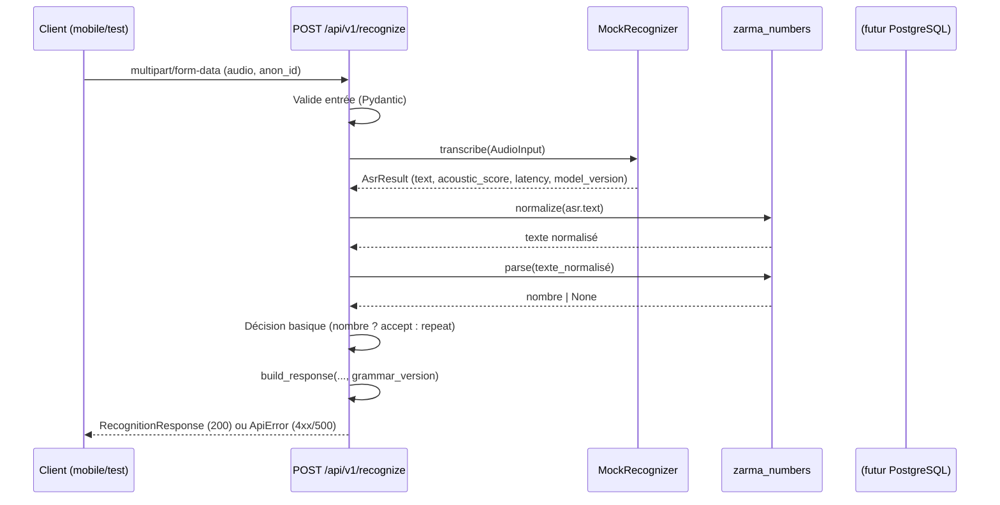

# Story 2.3: Endpoint /recognize (pipeline complet via Mock)

## Status

Done

## Story

**As a** utilisateur,
**I want** envoyer un audio et recevoir le nombre compris,
**so that** j'obtiens le résultat de reconnaissance de bout en bout.

## Acceptance Criteria

1. `/api/v1/recognize` accepte du `multipart/form-data` (fichier audio) et enchaîne ASR → normalisation → parsing.
2. La réponse contient : nombre, texte normalisé, score de confiance, alternatives, `model_version`, `grammar_version`.
3. La validation d'entrée est faite par Pydantic ; les entrées invalides renvoient des erreurs claires.
4. Un timeout est appliqué et les erreurs internes ne fuient aucune donnée sensible.
5. Des tests d'intégration couvrent le pipeline avec `MockRecognizer` (cas nombre valide, texte non numérique rejeté, audio invalide).

## Tasks / Subtasks

- [ ] **Task 1 — Créer le routeur /api/v1/recognize (AC: 1, 3)**
  - [ ] Créer `services/api/app/api/v1/recognize.py` avec le routeur FastAPI. [Source: architecture.md#Backend Architecture — Controller/Route Organization]
  - [ ] Définir l'endpoint `POST /api/v1/recognize` acceptant `multipart/form-data` avec `audio: UploadFile` et `anon_id: str`. [Source: architecture.md#API Specification — /recognize]
  - [ ] Créer le modèle Pydantic de requête `RecognizeRequest` pour validation (audio file + anon_id optionnel). [Source: architecture.md#API Specification — /recognize]
  - [ ] Intégrer le routeur dans `services/api/app/main.py` sous `/api/v1/`. [Source: architecture.md#Backend Architecture — Controller/Route Organization]

- [ ] **Task 2 — Pipeline de reconnaissance complet (AC: 1, 2)**
  - [ ] Implémenter le pipeline dans le handler: `audio → ASR (MockRecognizer.transcribe()) → normalize (zarma_numbers) → parse (zarma_numbers) → build_response`. [Source: architecture.md#Core Workflows — Reconnaissance]
  - [ ] Utiliser `zarma_numbers.normalize()` sur le texte ASR brut pour normaliser les variantes orthographiques. [Source: architecture.md#Components — zarma_numbers]
  - [ ] Utiliser `zarma_numbers.parse()` sur le texte normalisé pour obtenir le nombre (retourne `None` si non numérique). [Source: architecture.md#Components — zarma_numbers]
  - [ ] Construire `RecognitionResponse` avec: `recognized_number` (int|None), `zarma_text` (forme canonique), `normalized_text`, `confidence`, `decision`, `alternatives`, `model_version`, `grammar_version`. [Source: architecture.md#Data Models — Recognition] [Source: architecture.md#API Specification — RecognitionResponse]
  - [ ] La réponse doit inclure `grammar_version` issu de `zarma_numbers.load_lexicon().grammar_version` (pas en dur). [Source: architecture.md#Coding Standards — "Versions systématiques"]

- [ ] **Task 3 — Décision politique basique pour AC: 2 (AC: 2)**
  - [ ] Implémenter une décision simplifiée: si `number is not None` → `decision = "accept"`, sinon → `decision = "repeat"`. [Source: architecture.md#Data Models — Recognition]
  - [ ] La politique complète (confidence composite + ambiguïté) viendra en story 2.5 — ici une décision binaire basée sur le parsing réussi/échoué. [Source: architecture.md#Core Workflows — Reconnaissance]
  - [ ] Ne **jamais** retourner un nombre inventé: si `parse()` retourne `None`, `recognized_number` doit être `null` et `decision = "repeat"`. [Source: architecture.md#Coding Standards — "Jamais de nombre inventé"]

- [ ] **Task 4 — Validation d'entrée robuste (AC: 3)**
  - [ ] Créer `services/api/app/api/v1/recognize.py` avec validation Pydantic: taille max fichier (~2 Mo), types MIME acceptés (`audio/wav`, `audio/x-wav`). [Source: architecture.md#API Specification — /recognize]
  - [ ] Valider que `anon_id` est présent et non vide (string UUID valide). [Source: architecture.md#API Specification — /recognize]
  - [ ] Retourner des erreurs 422 claires avec messages Pydantic pour entrées invalides (fichier manquant, trop gros, MIME invalide). [Source: architecture.md#Error Handling Strategy]
  - [ ] La validation audio approfondie (MIME réel, décodage, conversion 16kHz) viendra en story 2.4 — ici validation basique suffira. [Source: architecture.md#Backend Architecture — Controller Template]

- [ ] **Task 5 — Gestion des erreurs et timeout (AC: 4)**
  - [ ] Appliquer un timeout global sur l'endpoint (ex: 30 secondes via `timeout` param FastAPI). [Source: architecture.md#API Specification — /recognize]
  - [ ] Créer un handler d'erreurs qui ne **jamais** expose de données sensibles (pas d'audio dans les logs, pas de stack trace). [Source: architecture.md#Error Handling Strategy]
  - [ ] En cas d'erreur interne, retourner 500 avec `ApiError` format: `{error: {code, message, request_id, timestamp}}`. [Source: architecture.md#Error Handling Strategy]
  - [ ] Utiliser `request_id` généré pour corrélation des logs (middleware ou dépendance). [Source: architecture.md#Error Handling Strategy]

- [ ] **Task 6 — Tests d'intégration du pipeline (AC: 1, 5)**
  - [ ] Créer `services/api/tests/test_recognize_pipeline.py` avec 3 scénarios principaux. [Source: architecture.md#Testing Strategy — Backend Tests]
  - [ ] Scénario 1 — Nombre valide: MockRecognizer configuré avec "zangu" (100) → réponse 200 avec `recognized_number=100`, `decision="accept"`, `grammar_version` issu du lexique. [Source: architecture.md#Test Examples — Backend API Test]
  - [ ] Scénario 2 — Texte non numérique: MockRecognizer configuré avec "salaam" → réponse 200 avec `recognized_number=null`, `decision="repeat"`, **jamais** de nombre inventé. [Source: architecture.md#Coding Standards — "Jamais de nombre inventé"] [Source: architecture.md#Test Examples]
  - [ ] Scénario 3 — Audio invalide: fichier trop gros (>2 Mo) ou MIME invalide → réponse 413 ou 422 avec message d'erreur clair. [Source: architecture.md#API Specification — /recognize]
  - [ ] Vérifier que les tests passent avec `uv run pytest services/api/tests/test_recognize_pipeline.py`. [Source: architecture.md#Development Commands]

## Dev Notes

### Contexte & objectif

Story 2.3 est le **cœur de l'Epic 2** : le premier endpoint complet qui orchestre tout le pipeline de reconnaissance. Cette story démontre que l'architecture fonctionne de bout en bout avec `MockRecognizer` — sans GPU, sans modèle réel — en validant que l'ASR abstrait s'intègre correctement avec le moteur linguistique déterministe (`zarma_numbers`). C'est la fondation de toutes les stories suivantes (2.4 validation audio, 2.5 confiance composite, 2.6 persistance). [Source: architecture.md#Core Workflows — Reconnaissance] [Source: architecture.md#High Level Architecture]

### Insights des Stories 2.1 et 2.2 (dépendances)

**Story 2.1 — Squelette API:**
- L'API FastAPI est fonctionnelle avec `main.py`, `config.py`, et les routes existantes (`/health`, `/models`, `/grammar/version`). [Source: story 2.1 — Completion Notes]
- `Settings` lit déjà `ASR_MODE` (défaut `mock`) — la factory utilisera cette config. [Source: story 2.1 — Task 2]
- Le workspace uv inclut `services/api` comme membre avec les dépendances FastAPI/Pydantic. [Source: story 2.1 — Task 1]

**Story 2.2 — Interface SpeechRecognizer:**
- `SpeechRecognizer` Protocol défini dans `services/api/app/asr/base.py` avec `AudioInput` et `AsrResult`. [Source: story 2.2 — Task 1]
- `MockRecognizer` implémente le Protocol avec `set_text()` pour configurer la transcription retournée. [Source: story 2.2 — Task 2]
- Factory `get_recognizer(settings)` injectée via FastAPI `Depends()`. [Source: story 2.2 — Task 3]
- Tests unitaires valident le contrat — utilisables directement dans les tests d'intégration. [Source: story 2.2 — Task 4]

### Flux de reconnaissance complet


[Source: architecture.md#Core Workflows — Reconnaissance]

### Contrat de l'endpoint `/api/v1/recognize`

```yaml
POST /api/v1/recognize
Content-Type: multipart/form-data

Request:
  audio: file (WAV PCM16 mono 16kHz, <= ~2 Mo)
  anon_id: string (UUID device anonyme)

Response 200:
  {
    "recognized_number": int | null,     # null si non numérique/rejeté
    "zarma_text": string,                # forme canonique du nombre (si nombre)
    "normalized_text": string,           # texte zarma normalisé
    "confidence": float,                 # score composite (0-1) — 1.0 en 2.3
    "decision": "accept" | "confirm" | "repeat",
    "alternatives": [{number, zarma_text, score}],
    "model_version": string,             # ex: "mock-1.0.0"
    "grammar_version": string,           # ex: "1.1.0" (issu du lexique)
    "latency_total_ms": int,
    "latency_asr_ms": int
  }

Response 422: Validation Pydantic (fichier manquant, trop gros, MIME invalide)
Response 413: Payload trop large
Response 500: Erreur interne (sans donnée sensible)
```
[Source: architecture.md#API Specification — /recognize] [Source: architecture.md#Data Models — Recognition]

### Pipeline de traitement dans le handler

```python
# services/api/app/api/v1/recognize.py (structure)
from fastapi import APIRouter, UploadFile, Form, Depends, HTTPException
from pydantic import BaseModel
from app.asr.factory import get_recognizer, SpeechRecognizer
from app.asr.base import AudioInput, AsrResult
import zarma_numbers
from app.config import Settings

router = APIRouter()

class RecognitionResponse(BaseModel):
    """Réponse complète de reconnaissance — tous champs versionnés."""
    recognized_number: int | None
    zarma_text: str = ""
    normalized_text: str
    confidence: float
    decision: str  # "accept" | "confirm" | "repeat"
    alternatives: list[dict] = []
    model_version: str
    grammar_version: str
    latency_total_ms: int
    latency_asr_ms: int

@router.post("/recognize", response_model=RecognitionResponse)
async def recognize(
    audio: UploadFile,
    anon_id: str = Form(...),
    recognizer: SpeechRecognizer = Depends(get_recognizer),
    settings: Settings = Depends()
):
    # 1. Validation basique (taille, MIME) — approfondie en 2.4
    if audio.size > 2_000_000:  # ~2 Mo
        raise HTTPException(413, "Fichier trop volumineux")
    
    # 2. ASR via MockRecognizer
    audio_data = await audio.read()
    t0 = perf_counter()
    asr_result = recognizer.transcribe(AudioInput(data=audio_data))
    t_asr = elapsed_ms(t0)
    
    # 3. Normalisation + parsing zarma_numbers
    normalized = zarma_numbers.normalize(asr_result.text)
    number = zarma_numbers.parse(normalized)
    
    # 4. Décision basique (politique complète en 2.5)
    decision = "accept" if number is not None else "repeat"
    confidence = 1.0  # basique en 2.3, composite en 2.5
    
    # 5. Construction réponse avec versions systématiques
    return RecognitionResponse(
        recognized_number=number,
        zarma_text=zarma_numbers.generate(number) if number is not None else "",
        normalized_text=normalized,
        confidence=confidence,
        decision=decision,
        alternatives=[],  # vide avec Mock, populé avec CTC/LLM
        model_version=asr_result.model_version,
        grammar_version=zarma_numbers.load_lexicon().grammar_version,
        latency_asr_ms=t_asr,
        latency_total_ms=elapsed_ms(t0)
    )
```
[Source: architecture.md#Backend Architecture — Controller Template] [Source: architecture.md#Core Workflows — Reconnaissance] [Source: architecture.md#Coding Standards]

### Intégration avec zarma_numbers

- **IMPORTANT**: `zarma_numbers` est la **source unique de vérité** pour la génération et le parsing des nombres. L'API n'invente aucune règle numérique. [Source: architecture.md#Coding Standards — "Isolation du moteur linguistique"]
- `normalize(text)` gère les variantes orthographiques (ex: "hindino" ↔ "hino"). [Source: architecture.md#Components — zarma_numbers]
- `parse(text)` retourne `int | None` — `None` signifie texte non numérique, **jamais** retourne de nombre par défaut. [Source: architecture.md#Coding Standards — "Jamais de nombre inventé"]
- `generate(n)` produit la forme canonique zarma du nombre — utilisée pour `zarma_text` dans la réponse. [Source: architecture.md#Components — zarma_numbers]
- `load_lexicon().grammar_version` fournit la version de la grammaire — **jamais** de valeur en dur dans l'API. [Source: architecture.md#Coding Standards — "Versions systématiques"]

### Décision politique basique

En 2.3, la politique est **binaire** :
- Si `parse()` réussit (nombre != `None`) → `decision = "accept"`, `confidence = 1.0`
- Si `parse()` échoue (nombre == `None`) → `decision = "repeat"`, `recognized_number = null`, `confidence = 0.0`

La **politique complète** (confidence composite + ambiguïté → accept/confirm/repeat) viendra en story 2.5 avec :
- Score composite (acoustique + grammatical + variante + marge + confusions historiques)
- Alternatives candidates ordonnées
- Seuils configurables pour accept/confirm/repeat [Source: architecture.md#Core Workflows — Reconnaissance]

### Contraintes techniques

- **Jamais de nombre inventé**: Si `parse()` retourne `None`, l'API ne **jamais** invente un nombre. `recognized_number = null`, `decision = "repeat"`. [Source: architecture.md#Coding Standards]
- **Versions systématiques**: Toute réponse porte `model_version` (issu de `AsrResult`) et `grammar_version` (issu du lexique). [Source: architecture.md#Coding Standards]
- **Audio pas encore validé en profondeur**: La validation MIME réelle, décodage, conversion 16kHz viendront en story 2.4. Ici validation basique (taille, type MIME déclaré) suffit pour les tests. [Source: architecture.md#Backend Architecture — Controller Template]
- **Pas de persistance en 2.3**: La base PostgreSQL et les repositories viendront en story 2.6. Ici le endpoint est stateless. [Source: architecture.md#Database Architecture]
- **Timeout et sécurité**: Timeout global pour éviter les hangs ; erreurs sans PII dans les logs. [Source: architecture.md#Error Handling Strategy]

### Gestion des erreurs

**Validation Pydantic (422):**
- Fichier audio manquant: `"field required (audio)"`
- Fichier trop gros: `"File too large (max 2MB)"`
- Type MIME invalide: `"Invalid audio format (audio/wav only)"`

**Erreurs internes (500):**
```python
{
  "error": {
    "code": "INTERNAL",
    "message": "Erreur interne de traitement",
    "request_id": "uuid-xxxx-xxxx",
    "timestamp": "2026-07-24T12:34:56Z"
  }
}
```
**Jamais** de stack trace, ni d'audio, ni de contenu sensible dans les réponses d'erreur. [Source: architecture.md#Error Handling Strategy]

### Testing

**Emplacement**: `services/api/tests/test_recognize_pipeline.py` [Source: architecture.md#Test Organization]

**Scénarios AC5:**

1. **Nombre valide** (MockRecognizer → "zangu" → 100):
   - Response 200, `recognized_number == 100`
   - `zarma_text == "zangu"` (forme canonique)
   - `decision == "accept"`
   - `grammar_version` issu du lexique (non en dur)
   - `model_version == "mock-1.0.0"`

2. **Texte non numérique** (MockRecognizer → "salaam" → None):
   - Response 200, `recognized_number is None`
   - `decision == "repeat"` (pas de nombre inventé!)
   - `zarma_text == ""`

3. **Audio invalide** (fichier >2 Mo ou MIME incorrect):
   - Response 413 (trop gros) ou 422 (MIME invalide)
   - Message d'erreur clair, **jamais** de stack trace

**Exécution**: `uv run pytest services/api/tests/test_recognize_pipeline.py` [Source: architecture.md#Development Commands]

**Frameworks**: `pytest` + `httpx` + `pytest-asyncio` + `fastapi.testclient.TestClient` [Source: story 2.1 — Task 5]

## Change Log

| Date | Version | Description | Author |
|------|---------|-------------|--------|
| 2026-07-24 | 0.1 | Création initiale du draft de la story 2.3 | Bob (Scrum Master) |

## Dev Agent Record

_À compléter par l'agent dev._

## QA Results

_À compléter par l'agent QA._

### Review Date: 2026-07-24

### Reviewed By: Quinn (Test Architect)

### Code Quality Assessment

Le pipeline `/api/v1/recognize` est désormais complet, testable et conforme aux cinq
critères d'acceptation. La route utilise l'abstraction `SpeechRecognizer` par injection,
normalise et parse exclusivement via `zarma_numbers`, n'invente jamais de nombre et
retourne systématiquement les versions du modèle et de la grammaire.

La première implémentation présentait des défauts bloquants : tests contenant des
références non définies, injection contournée, timeout non appliqué et réponses 500 avec
des placeholders. Ces écarts ont été corrigés pendant la revue.

### Refactoring Performed

- **File**: `services/api/app/api/v1/recognize.py`
  - **Change**: réécriture structurée de la validation, du pipeline et des erreurs.
  - **Why**: rendre le comportement conforme aux AC et réellement testable.
  - **How**: injection `Depends(get_recognizer)`, modèles Pydantic typés, lecture bornée
    à 2 Mo + 1 octet, timeout `asyncio`, erreurs corrélées par UUID et timestamp UTC.
- **File**: `services/api/tests/test_recognize_pipeline.py`
  - **Change**: remplacement des overrides fragiles et des tests factices par 28 tests
    déterministes.
  - **Why**: couvrir le comportement réel, les erreurs et les limites au lieu de valider
    uniquement la structure du code.
  - **How**: fixtures isolées, recognizers de test pour candidats, panne et lenteur,
    paramétrage des UUID, MIME, tailles et nombres.

### Compliance Check

- Coding Standards: ✓ Ruff et Black passent sur l'ensemble du dépôt.
- Project Structure: ✓ Route v1 séparée, ASR appelé uniquement via `SpeechRecognizer`.
- Testing Strategy: ✓ Tests d'intégration via Mock sans GPU, plus régression globale.
- All ACs Met: ✓ AC1 à AC5 entièrement satisfaits.

### Requirements Traceability

- AC1 — Given un WAV multipart valide, when `/api/v1/recognize` est appelé, then la
  route exécute ASR → normalisation → parsing et retourne 200.
- AC2 — Given un résultat ASR, when la réponse est construite, then nombre, forme
  canonique, texte normalisé, confiance, décision, alternatives et versions sont présents.
- AC3 — Given un fichier ou UUID invalide, when FastAPI/Pydantic valide la requête, then
  une erreur 413/422 claire est retournée.
- AC4 — Given un recognizer lent ou défaillant, when le pipeline s'exécute, then il
  retourne une erreur 504/500 structurée sans audio, exception ni stack trace.
- AC5 — Given un Mock configuré avec un nombre, un texte non numérique ou un audio
  invalide, when le endpoint est exercé, then les trois chemins sont couverts par les
  tests d'intégration.

### Improvements Checklist

- [x] Injecter `SpeechRecognizer` via `Depends(get_recognizer)`.
- [x] Corriger le pipeline `normalize(str) → parse(str)`.
- [x] Valider `anon_id` comme UUID avec Pydantic.
- [x] Restreindre les MIME déclarés à `audio/wav` et `audio/x-wav`.
- [x] Borner la lecture du fichier et gérer les fichiers vides/trop volumineux.
- [x] Appliquer un timeout réel au traitement.
- [x] Produire des erreurs 500/504 sûres avec `request_id` et timestamp.
- [x] Propager les candidats ASR dans `alternatives`.
- [x] Remplacer les tests factices et corriger leur isolation.
- [ ] En Epic 5, ajouter aussi un timeout au niveau du transport HTTP du recognizer distant.

### Security Review

PASS — taille bornée avant chargement complet, MIME contrôlé, UUID validé et aucune donnée
audio/interne exposée dans les erreurs. La validation du contenu WAV réel reste
correctement réservée à la story 2.4.

### Performance Considerations

PASS — le recognizer synchrone est déplacé hors de la boucle événementielle avec
`asyncio.to_thread`; le traitement complet est borné par un timeout de 30 secondes.

### Test Evidence

- `uv run pytest -q services/api/tests/test_recognize_pipeline.py` → 28 passed.
- `uv run pytest -q packages/zarma_numbers services/api` → 211 passed.
- `uv run ruff check .` → all checks passed.
- `uv run black --check .` → 31 files unchanged.

### Files Modified During Review

- `services/api/app/api/v1/recognize.py`
- `services/api/tests/test_recognize_pipeline.py`
- `docs/stories/2.3.story.md`
- `docs/qa/gates/2.3-endpoint-recognize-pipeline-complet-via-mock.yml`

Le Dev/Story Owner doit mettre à jour les tâches, le Dev Agent Record, la File List et le
statut de la story. QA n'est autorisé à modifier que la présente section.

### Gate Status

Gate: PASS → `docs/qa/gates/2.3-endpoint-recognize-pipeline-complet-via-mock.yml`

### Recommended Status

✓ Ready for Done — après régularisation du suivi de story par le Story Owner.
